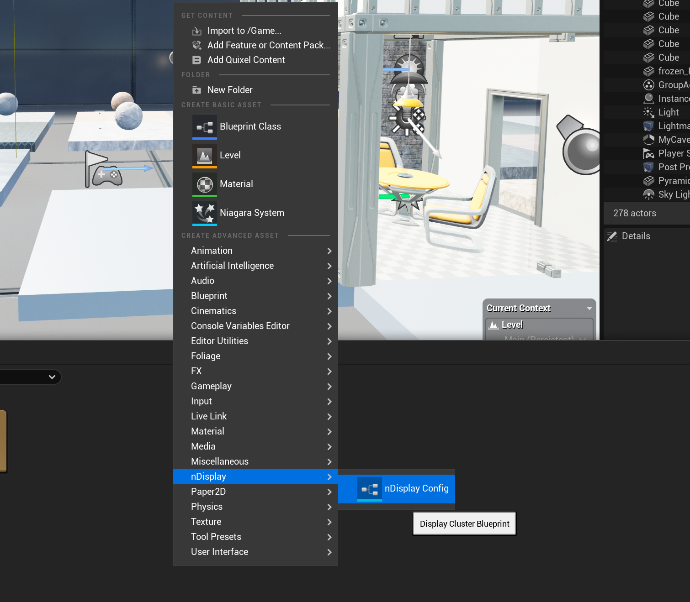

CAVE Unreal Setup
========================

if the hardware configuration is working properly, you can start from this unreal step directly.

also this tutorial assumes that you are familiar with unreal framework.

  

1. Add nDisplay configuration to your project
~~~~~~~~~~~~~~~~~~~~~~~~~~~~~~~~~~~~~~~~~~~~~~~~~~~~~~~~~~

open your project and add nDisplay asset as shown below, if you use another version of unreal you may need to install additional plugins to be able to use nDisplay

.. raw:: html

   

2. import configuration
~~~~~~~~~~~~~~~~~~~~~~~~~

name your nDisplay Config, and then you can  import my pre-set configuration into your model

2.1.Name your configuration
 .. figure:: imagesunreal/u2.png
    :width: 600px
    :align: center
 .. raw:: html

   

2.2.Edit your configuraiton   
 .. figure:: imagesunreal/u3.png
    :width: 600px
    :align: center
 .. raw:: html

   

2.3.import the following configurtion
 .. figure:: imagesunreal/u4.png
    :width: 600px
    :align: center
 .. raw:: html

   

2.4. after importing your configuration your nDisplay should like this 
 .. figure:: imagesunreal/u5.png
    :width: 500px
    :align: center
 .. raw:: html

   

   

2.5.compile the project and save, then go to the switchboard and import your configuration one more time   
 .. figure:: imagesunreal/u6.png
    :width: 500px
    :align: center
 .. raw:: html

   

2.6. make a new configuration
 .. figure:: imagesunreal/u7.png
    :width: 500px
    :align: center
 .. raw:: html

   

  

2.7. add ndisplay to the configuration 
 .. figure:: imagesunreal/u8.png
    :width: 500px
    :align: center
 .. raw:: html

   

  

2.8. after adding your nDisplay Configuration reimport my configuration one more time you should end up with something like this
 .. figure:: imagesunreal/u9.png
    :width: 500px
    :align: center
 .. raw:: html

   

 

3. Move copy of the project to the CAVE HPC (Must be an instance of the project - same version, same objects)
~~~~~~~~~~~~~~~~~~~~~~~~~~~~~~~~~~~~~~~~~~~~~~~~~~~~~~~~~~~~~~~~~~~~~~~~~~~~~~~~~~~~~~~~~~~~~~~~~~~~~~~~~~~~~~~~~~~~~~~~~~~

3.1. go to winscp it will help you move the project from the client to the server 
 .. figure:: imagesunreal/u10.png
    :width: 500px
    :align: center
 .. raw:: html

   

 

3.2. go to the following address, it’s the default workspace 
 .. code:: bash

     /D:/Unreal Projects/NewSetup

 .. figure:: imagesunreal/u11.png
    :width: 500px
    :align: center
 .. raw:: html

   

 

3.3. Paste all files of your project in the repo
 .. figure:: imagesunreal/u12.png
    :width: 500px
    :align: center
 .. raw:: html

   

 

3.4. always make sure the the following setting is set for each node 
 .. figure:: imagesunreal/u13.png
    :width: 400px
    :align: center
 .. raw:: html

   

 

4. Running the Project
~~~~~~~~~~~~~~~~~~~~~~~~~~~~~~~~~~~~~~

4.1. you can monitor switchboard for updates as the system progress in time
 .. figure:: imagesunreal/u14.png
    :width: 400px
    :align: center
 .. raw:: html

   

 

4.2. as you see you can notice the change in GpuUtilization
 .. figure:: imagesunreal/u15.png
    :width: 500px
    :align: center
 .. raw:: html

   

 

4.3. the CAVE desktop should start showing you the 3D model
 .. figure:: imagesunreal/u16.png
    :width: 500px
    :align: center
 .. raw:: html

   

 

