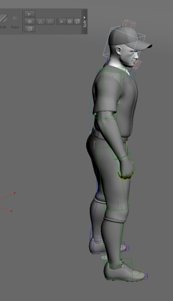
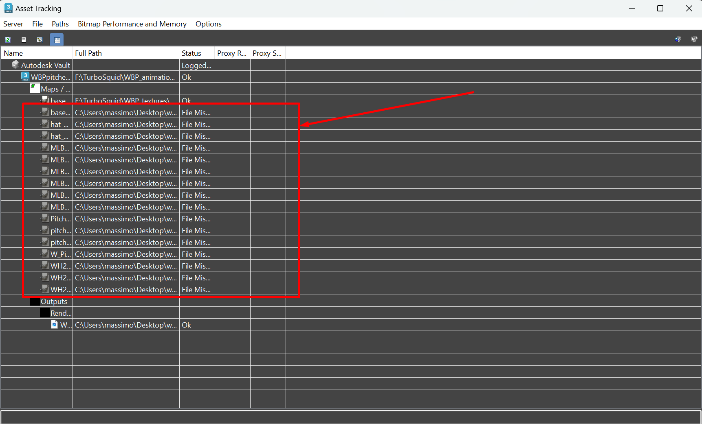
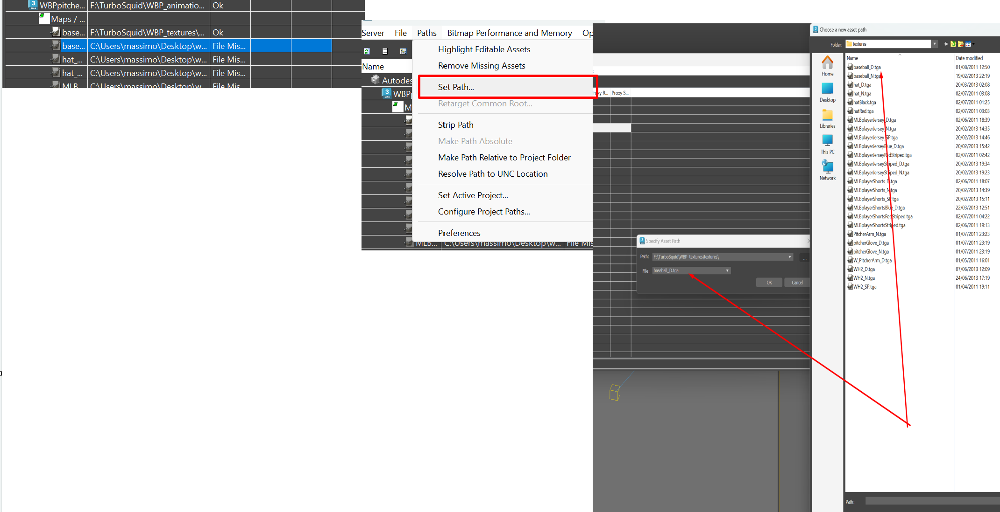
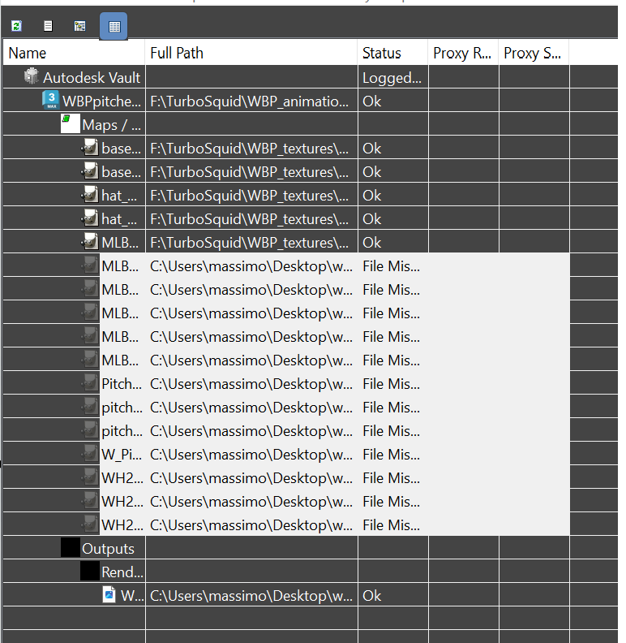
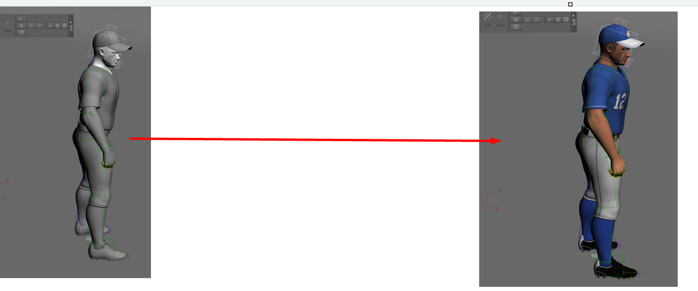
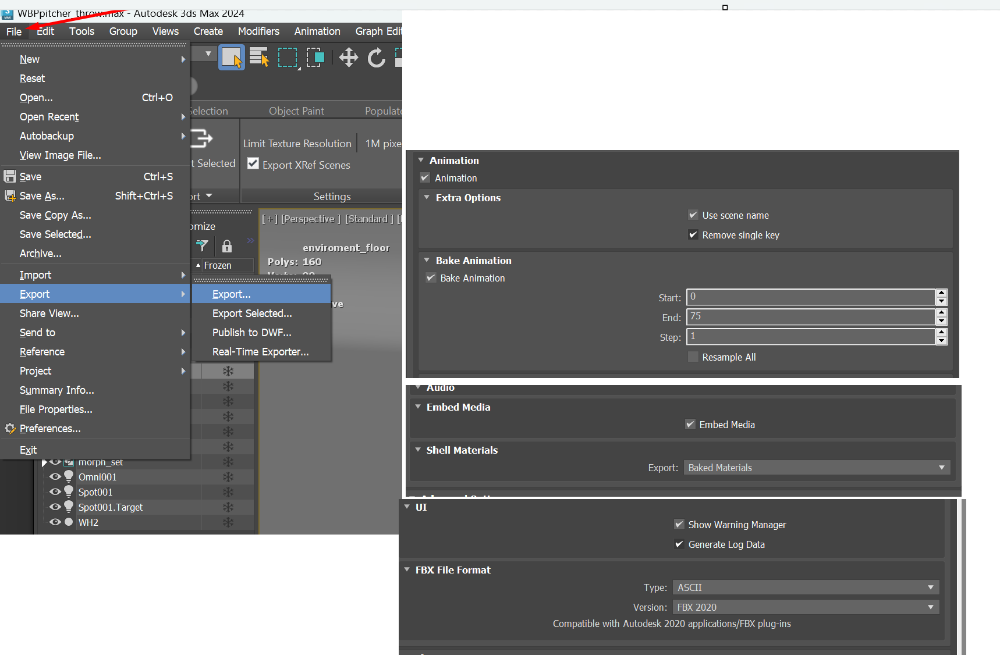
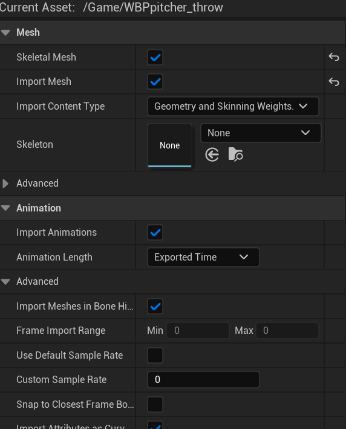
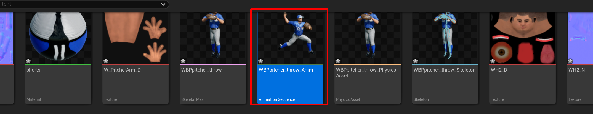

3D MAX | FBX to CAVE Through Unreal
============================================
This project started with downloading assets from `TurboSquid <https://www.turbosquid.com/>`_, after downloading those assets some of them can be opened using 3D Max software.

- I downloaded the FBX files from the website, opened them using 3D Max software and unzipped those files.

.. figure:: imagesim/w30.png
   :width: 400px
   :align: center
.. raw:: html

   

- open the animations folder and open the folder using your current 3D Max Version, however after you open the project, 3D MAX may fail to render materials and textures and you will get a result like this :

.. raw:: html

   

Baseballer without material or texture

at this case 3D Max needs to get updated about the bath of materials and textures, to do so use your keyboard and click on **Shift+T**  this will open asset tracking for you 

.. raw:: html

   

it looks like those files can’t be tracked, update their path by going to path and setpath then choose the location of the texture, normally as you download assets from turbosquid they will remain in a folder that have their name.

.. raw:: html

   

you can select batch of those objects and update them in one step if they have the same path

.. raw:: html

   

after you update the paths you should see baseballer in colours updated as shown below

.. raw:: html

   

- now we can export the files to unreal engine and make sure that the following FBX export configuration are enabled
    - Animation Export is activated, and Baked
    - Materials are baked
    - FBX forma is ASCII and uses FBX 2020

.. raw:: html

   

- Now we can import these assets into Unreal Engine as follows, make sure you are importing these files using the following settings
    - Import Animation is enabled

.. raw:: html

   

- if you double click over the WBPpitcher_throw_Anim asset you should be able to get the following animation

.. raw:: html

   

.. raw:: html

   <iframe width="560" height="315" src="https://www.youtube.com/embed/xud3yijCMJU" frameborder="0" allowfullscreen></iframe>   
.. raw:: html

   

 

Now you can go make your own landscape and import our the rest of your assets and finally import default ndisplay configuration into your project 

.. toctree::
   :maxdepth: 6
   

   importunreal
