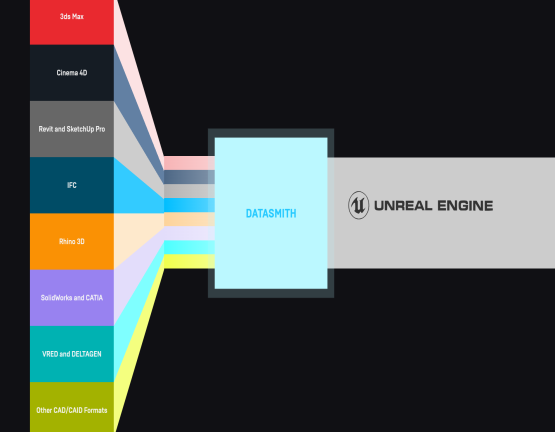
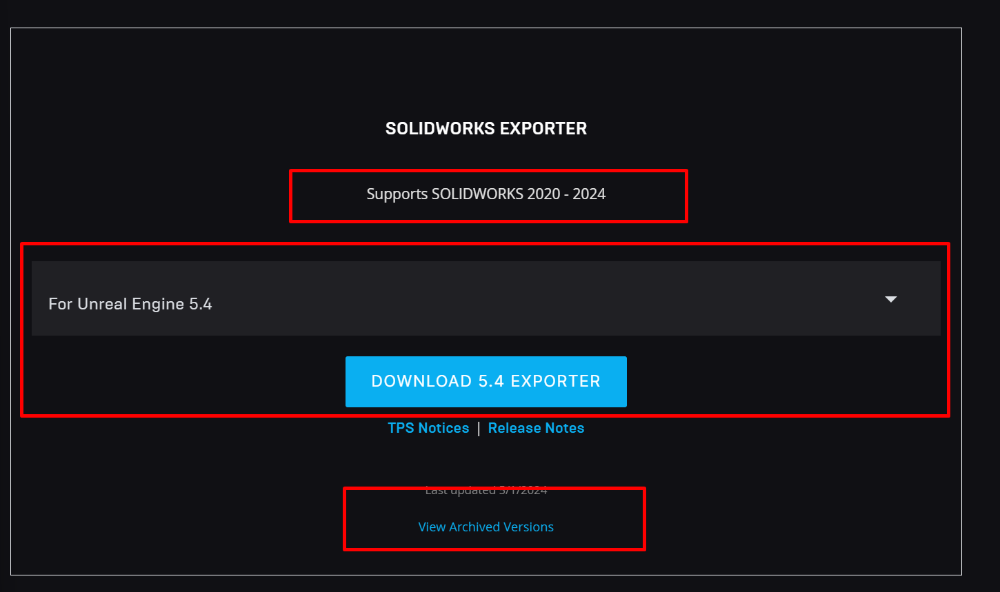
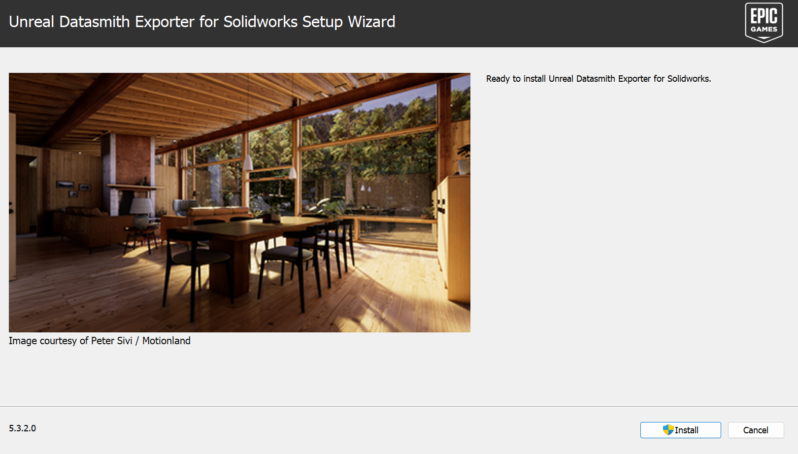
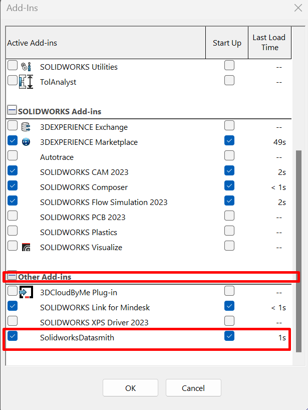
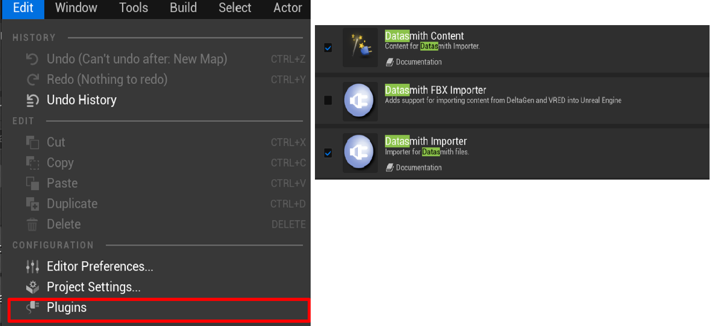
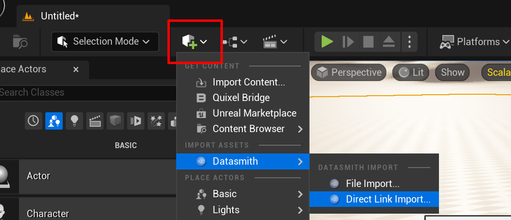
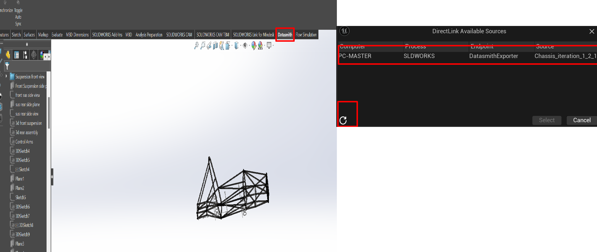
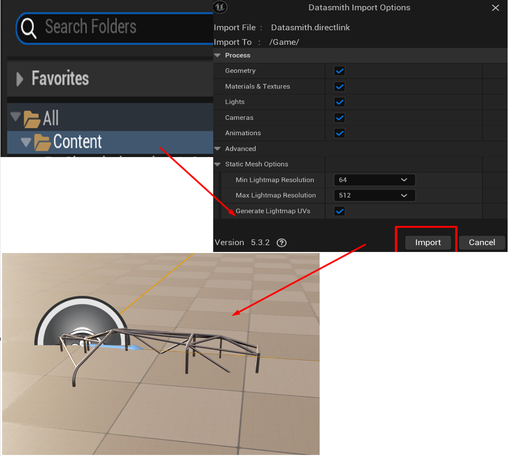

3D SolidWorks model on CAVE - Through Unreal
==========================================================
Either you have an animation or 3D model object, you can export your model/Animation to Unreal and then animate it on the CAVE.

DATASMITH is a very powerful tool it will allow you  to export your model/animation into unreal engine

.. raw:: html

   

1-Install Datasmith For SOLIDWORKS
+++++++++++++++++++++++++++++++++++++++
To do so we will need to install DATASMITH first into any PC !

make sure you are installing the correct version for both Unreal Engine and SolidWorks !

.. raw:: html

   

For older version of unreal you can check **View Archived Versions,** for this tutorial i will be working with **Unreal Engine 5.3**

Proceed with installation steps !

.. raw:: html

   

after installation and as you open SOLIDWORKS you should get a similar window that notify you  that it detected a new plugin !, make sure it’s activated 

.. raw:: html

   

2- Install Datasmith Plugin for Unreal Engine
++++++++++++++++++++++++++++++++++++++++++++++++++++

Now you can go ahead and download **Datasmith Content** plugin in unreal engine

.. raw:: html

   

3- Share your 3D model through Datasmith
+++++++++++++++++++++++++++++++++++++++++++++++
open your **SOLIDWORKS project** and open a **blank unreal engine project** in your blank unreal project you should be able to get the content from solidworks project by clicking 

quick add → Datasmith → Direct Link Import 

Hint : If you can’t find Datasmith extension this probably means you don’t have Datasmith plugin installed on your unreal engine

.. raw:: html

   

If you have an opened **solidworks project with Datasmith extension** you should be able to find it as an active session in the following window, you can look for new session using the refresh button from unreal engine 

.. raw:: html

   

choose your session and choose the folder you are willing to store files into, if you want to have specific import options feel free to apply your own options, then your 3D model will spawn automatically into your Unreal Engine Project

.. raw:: html

   

4- Apply any transformation, rotation or scaling for you 3D model
+++++++++++++++++++++++++++++++++++++++++++++++++++++++++++++++++
at this step you can make any edits you need for 3D object you can change the background or lighting, scale your model or make any necessary manipulations you want for the 3D object

.. figure:: imagesim/w9.png
   :width: 400px
   :align: center
.. raw:: html

   

up to this point your project is unreal ready, one additional step is needed to make the project CAVE Ready !

The last step of our project will be to import nDisplay Configuration into Unreal Project and your project 3D model will be **CAVE - Ready** 

.. toctree::
   :maxdepth: 6
   

   importunreal

If you want to import solidworks animation into your unreal project please follow the following tutorial 

.. toctree::
   :maxdepth: 6
   
   sac