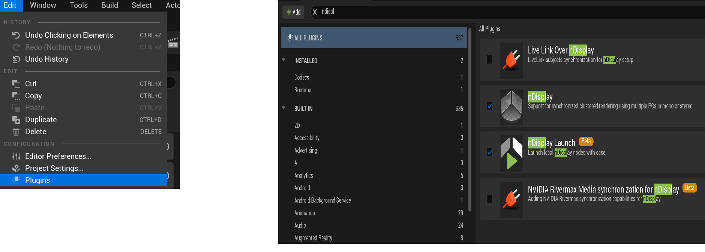
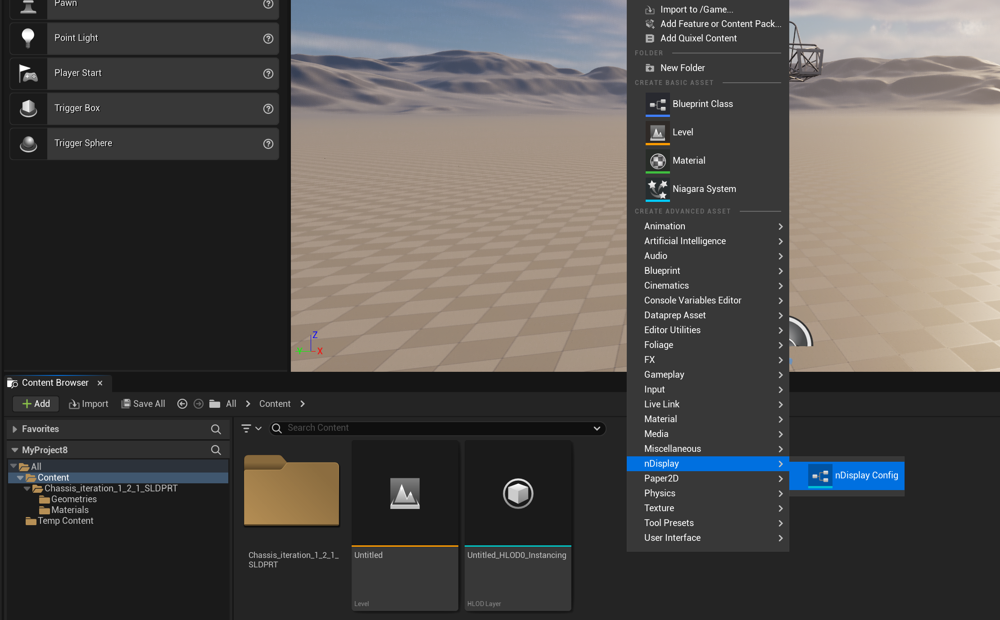
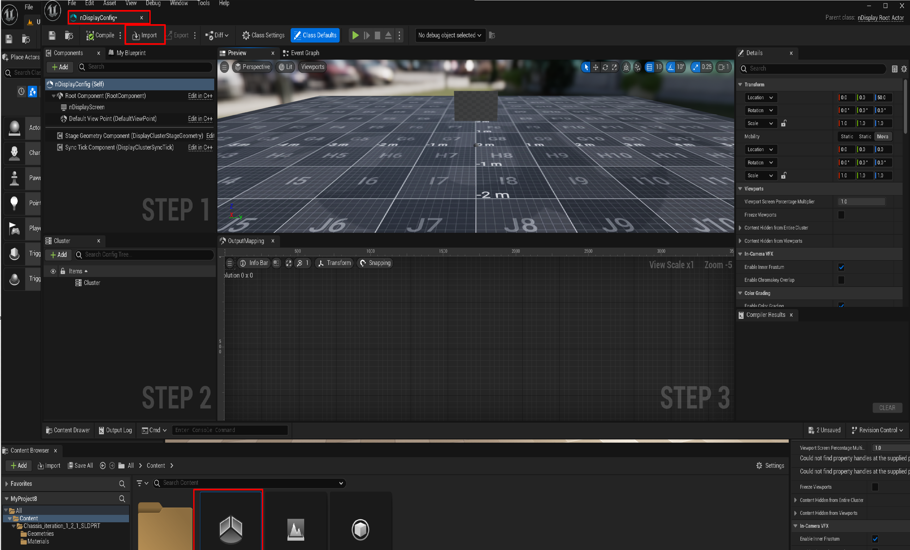
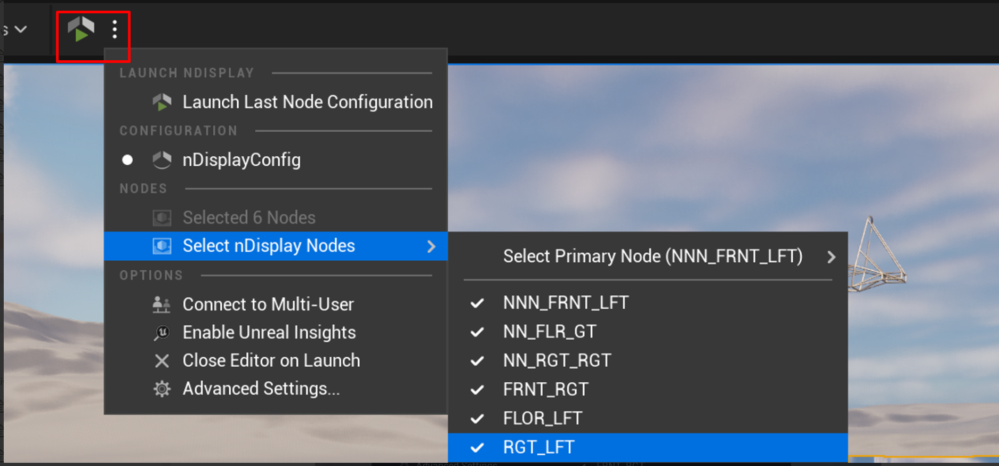
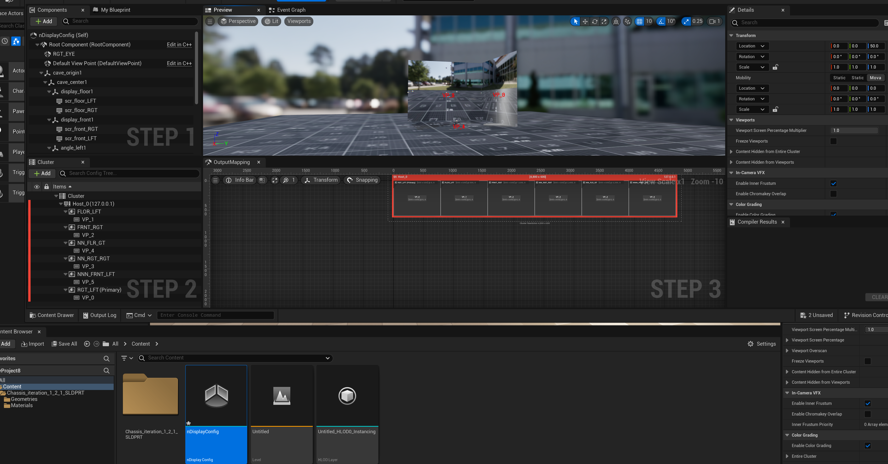

Import our default nDisplay configuraiton into your Unreal Project
===============================================================================
This tutorial imports nDisplay into chassis project, however you can implement same steps with your own project.

steps are divided into bullet points, go ahead and follow them.

- Download the CAVE nDisplay config. from the following link   `CAVE_ndisplay_Confi - Google Drive <https://drive.google.com/drive/folders/1Rm9yE_6NV4P8Z6IJi4_xyudaP_8Q7WQo>`_ make sure you are using your AUC mail so you can have access to the file

.. raw:: html

   

- go to content folder from content browser, and make right click and choose nDisplay configuration

.. raw:: html

   

- choose creating a new configuration and click finish, then drag and drop the asset into your scene

.. figure:: imagesim/w12.png
   :width: 400px
   :align: center
.. raw:: html

   

- double click on nDisplayConfig it will open the blueprint for you and now you should be able to edit the blueprint itself and choose import, so that we can import the cave ready configuration we downloaded from google drive

.. raw:: html

   

- after importing your project you should be able to find the following scene

.. raw:: html

   

- Now your project is ready to be used with CAVE, copy the project to the cave using WinSCP or Flash Drive or any method you prefer and you can run the project using nDisplay launcer button but make sure that all Nodes are active first !, and after you move your project to the CAVE click on the highlighted icon to run you model on CAVE

.. raw:: html

   

