MATLAB on CAVE - Through Unreal
+++++++++++++++++++++++++++++++++++++++++

Introduction
====================
 Vehicle Dynamics Blockset (Blockset provided from matlab)  provides fully assembled r models that simulate driving maneuvers in a 3D environment. You can use the prebuilt unreal engine scenes to visualize roads, traffic signs, trees, buildings, and other objects around the vehicle. You can customize the reference models by using your own data or by replacing a subsystem with your own model.

 .. figure:: imagesim/m1.png
   :width: 500px
   :align: center
 .. raw:: html

   

 So in summary, MATLAB will allow you to model the physics of the vehicle and advanced driving assistance algorithm (ADAS), the model sends the information about the vehicle position and acceleration to the game engine, unreal engine visualise Car and it’s surrounding objects, then it returns back data to the model so it can take actions based on the state of the surrounding objects.

 **This tutorial assumes you are familiar with MATLAB, Simulink and you know how to install add on.**

Integrating MATLAB with unreal
==================================
 - Make sure you have the correct versions of both MATLAB and Unreal since they work in pairs, for example having MATLAB 2024 imposes using Unreal Engine 5.1 also you will have to work with specific visual studio version if you are willing to edit your project in visual studio.
    
  the following requirements were gathered from `Unreal Engine Simulation Environment Requirements and Limitations - MATLAB & Simulink (mathworks.com) <https://www.mathworks.com/help/aeroblks/unreal-engine-simulation-environment-requirements-and-limitations.html>`_    

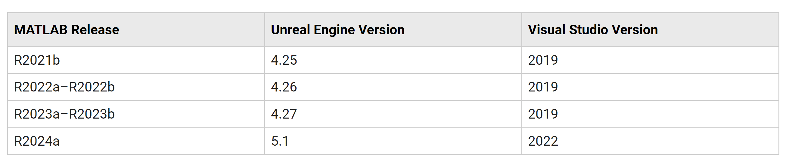
.. raw:: html

   

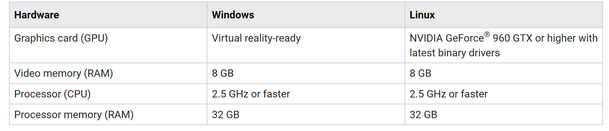
.. raw:: html

   

 
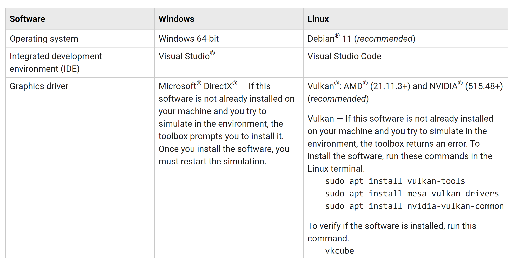
.. raw:: html

   

Now once you have the correct **MATLAB** version and **Unreal Engine,** you can go ahead and download MATLAB interface for unreal engine

.. Hint:: MATLAB have different interfaces for unreal engine, always make sure that you are downloading the right interface for the right Blockset

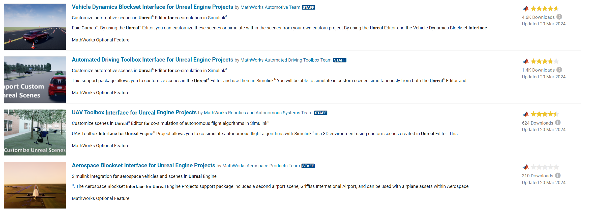
.. raw:: html

   

**For Example :**

If you are working with 

**Aerospace** **Blockset** → install : **Aerospace** Blockset interface for unreal Engine projects

**Vehicle Blockset** → install : **Vehicle** Blockset interface for unreal Engine projects 

.. Hint::  while you install the interface you may find that installation progress bar is frozen and you will start thinking that something is wrong, it’s totally fine their installation bar just doesn’t update which results this effect, let it finish downloading and get back to it after 30 minutes or more 

Different modes for using unreal with MATLAB
========================================================
MATLAB integration with unreal engine can have the following configurations :

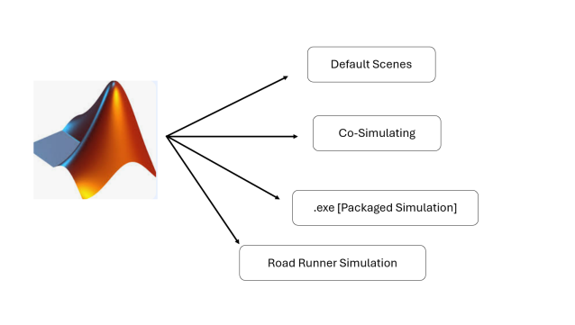
.. raw:: html

   

   
- Default Scenes can be simulated with the CAVE, however you can change the environment (for example change the city or add pedestrians or obstacles)
- Co-Simulating works with the CAVE, however it requires ton of processing power using xeon silver processing power will barely generate 2 nodes (shader compiler worker eats the whole processing power)
- .EXE (Packaged simulation ) is much more efficient and will allow you to run the whole system with minimal processing power consumption
- Road Runner Simulation, Explore it in your own

Default Scenes Mode
=========================================
This approach will require the least amount of configuration, you don’t even need to install unreal engine to work with this mode.

After installing the **vehicle dynamics blockset**, you can go directly and run it on CAVE 

- run the following command on MATLAB, This command starts a default example from MATLAB

 
.. code::

   vdynblksSceneCameraRayStart 

- After it loads the project you should be able to see somthing like this

 .. figure:: imagesim/m7.png
   :width: 400px
   :align: center
 .. raw:: html

   

   
- to make this template project CAVE ready, we will need to make some modification for this template, we delete the defualt camera we have

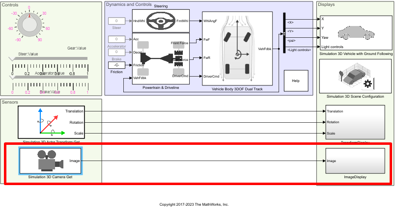
.. raw:: html

   

- we add the following blocks
  
    - Simulation 3D Camera Get (simulation 3D must be installed)
    - To Video Display (computer vision toolbox addon must be installed)

- we modify the block name and give name frnt_rgt and give it the following offset

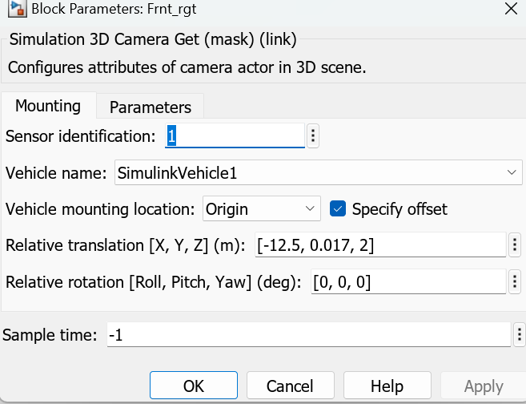
.. raw:: html

   

- for To Video Display configuration, make sure the size is set to True Size

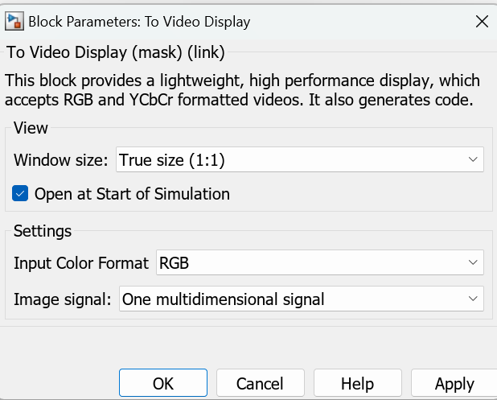
.. raw:: html

   

- take another copy from the block and paste it in the project, change the name of the other camera to Frnt_lft as shown below and change the offset value to -.017

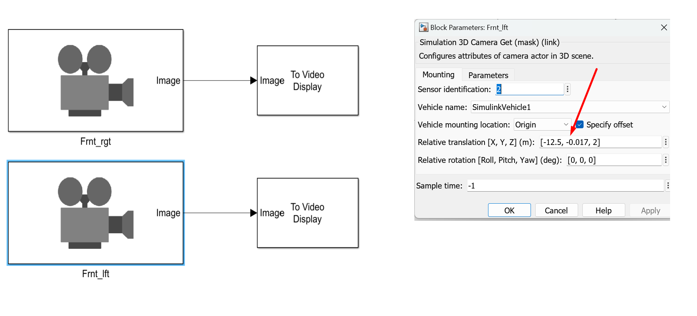
.. raw:: html

   

- now we repeat the same steps for the other nodes for example (Floor node, Right Node, Left Node) and then adjust the relative rotation value to -90

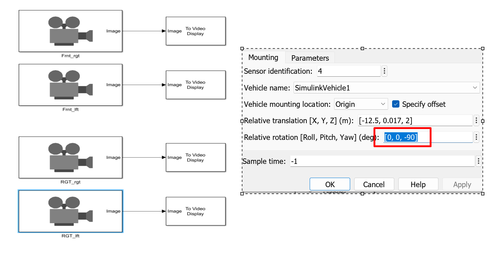
.. raw:: html

   

- Repeat Same steps for Floor node, and set the Pitch value to 90

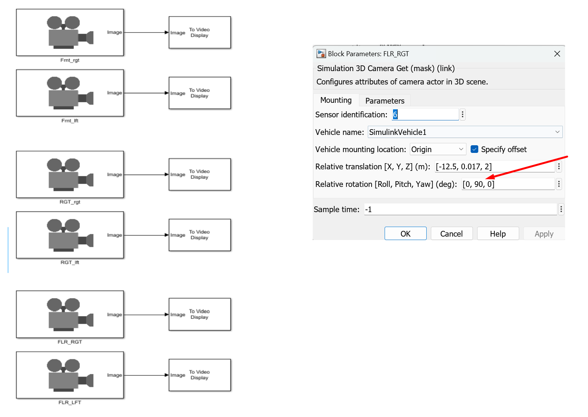
.. raw:: html

   

- if you run this locally you should get something similar to this

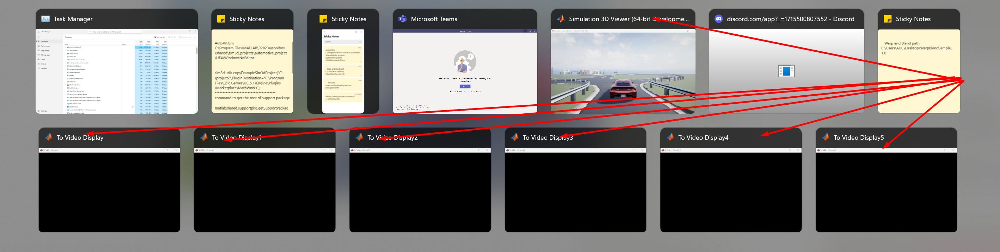
.. raw:: html

   

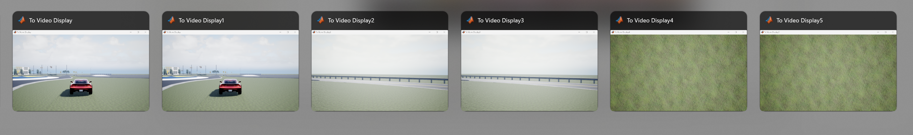
.. raw:: html

   

- the last step now is to move each window on it’s correct monitor, and finally apply MATLAB Cropping to the windows using Nvapi.

`Cropping Image using NVAPI <https://www.notion.so/Cropping-Image-using-NVAPI-d9a51eed5f1b472aa1acb543923019aa?pvs=21>`_

.. Hint:: if you are willing to adjust convergence for the 3D effect you may need to adjust the values of the angles ! check stereoscopy in details for more information

.. Hint:: you can try other starting examples instead of using vdynblksSceneCameraRayStart you can start with `vdynblksDblLaneChangeStart` 

Co-Simulating with unreal engine
============================================
to co-simulate with unreal engine you will have to follow these steps

- open MATLAB and Run the same command we used earlier !

 

.. code:: jsx
 
 vdynblksSceneCameraRayStart 

- access scene configuration and choose **Unreal editor**

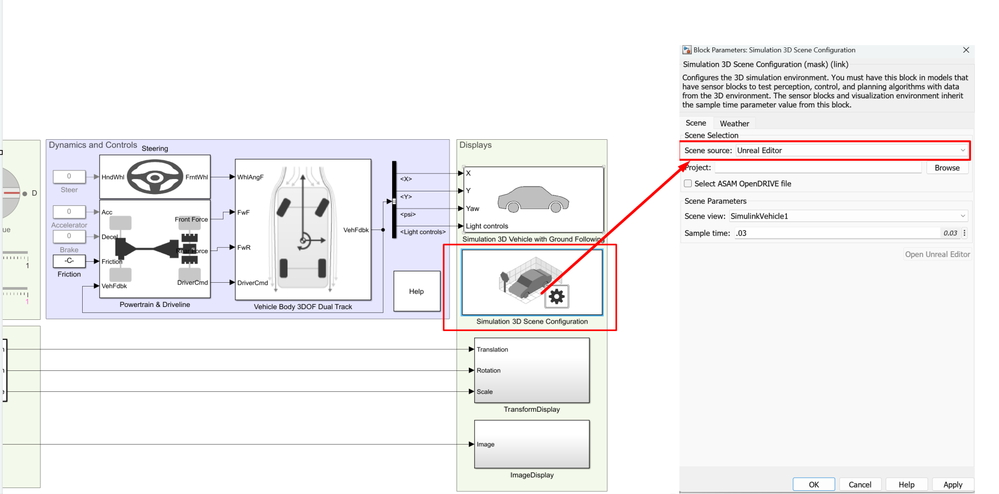
.. raw:: html

   

- Installing & Configuring Interface

The interface addon does include the following 

- files for **MATLAB** to communicate with **Unreal**
- files for **Unreal** to communicate with **MATLAB**

Since we did the download plugins for MATLAB and Unreal from **MATLAB** side only, this implies that we will have to move the files from **MATLAB** installation folder to **Unreal,** one of these files is the MathWorks Plugin, the files for unreal are stored in support package folder.

To get the path of the file write the following command in MATLAB 

.. code:: matlab

    matlabshared.supportpkg.getSupportPackageRoot()

it’s response will be something similar to : 

.. code:: matlab

   % your support package may be somewhere else ! this is an example !
   C:\ProgramData\MATLAB\SupportPackages\R2023a 

go to the support package path and you should find something as follows : 

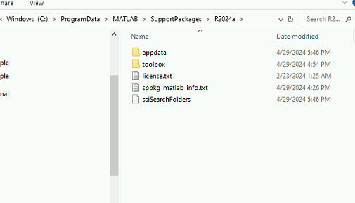
.. raw:: html

   

now navigate to toolbox → shared → sim3dprojects → spkg → plugins

this folder holds the plugin you need to move to unreal engine ! (you can’t install this plugin from the marketplace, you will have to install it manually)

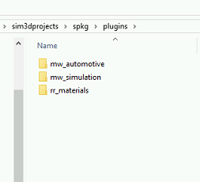
.. raw:: html

   

the following folder shows 3 plugins 

Mathworks Automotive content→ holds different objects that can be used in you simulation 

Mathworks Simulation plugin → communication interface between matlab and unreal 

Roadrunner Material → materials for roadrunner projects 

go into each subfolder of these plugins and take copy of each one of them, navigate to mw_simulation and you should find folder similar to this one:

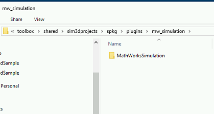
.. raw:: html

   

take a copy of this folder 

go to the following path : (Hint you may need to change the path depending on where did you install epic games and unreal engine !, search for the repo of you engine and search for plugins)

.. code:: matlab

   D:\Epic Games\UE_5.1\Engine\Plugins\

Make a New Folder and name it Marketplace, move the folders into market place and you should end up with something like that 

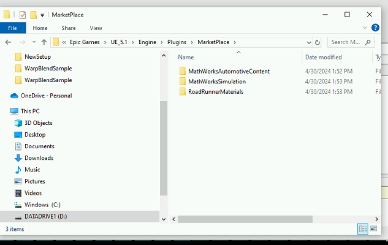
.. raw:: html

   

At this step your unreal engine editor is ready to work with **MATLAB**, however **MATLAB** support didn’t end at this point, **MATLAB** gives us also a starting project to use.