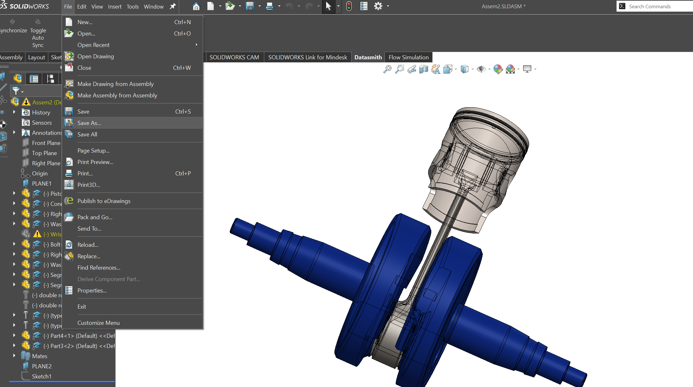
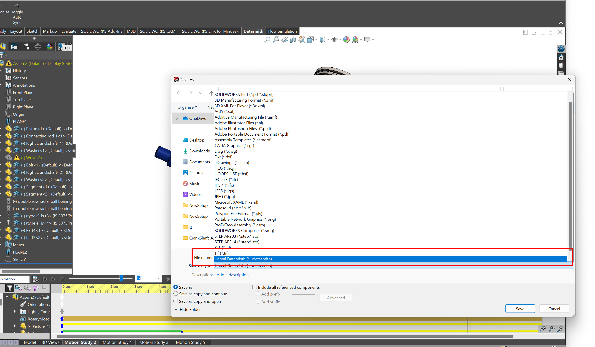
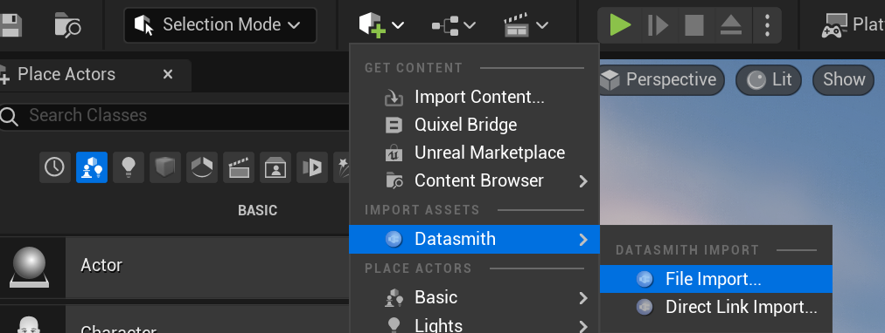
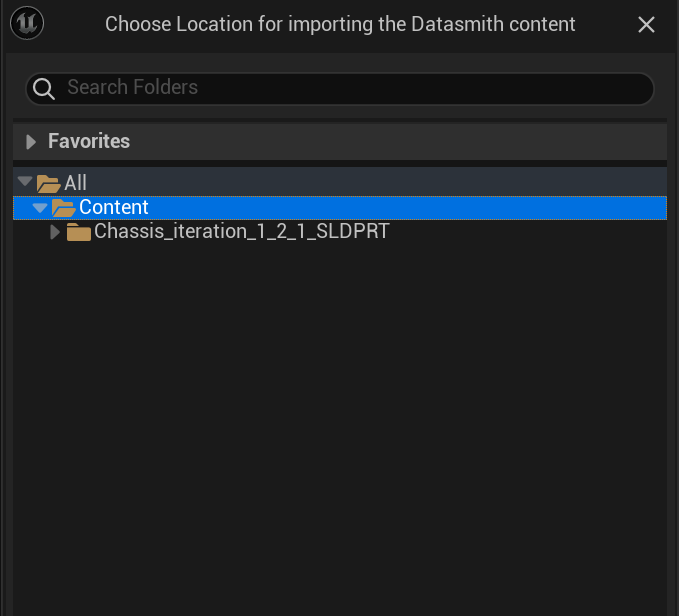
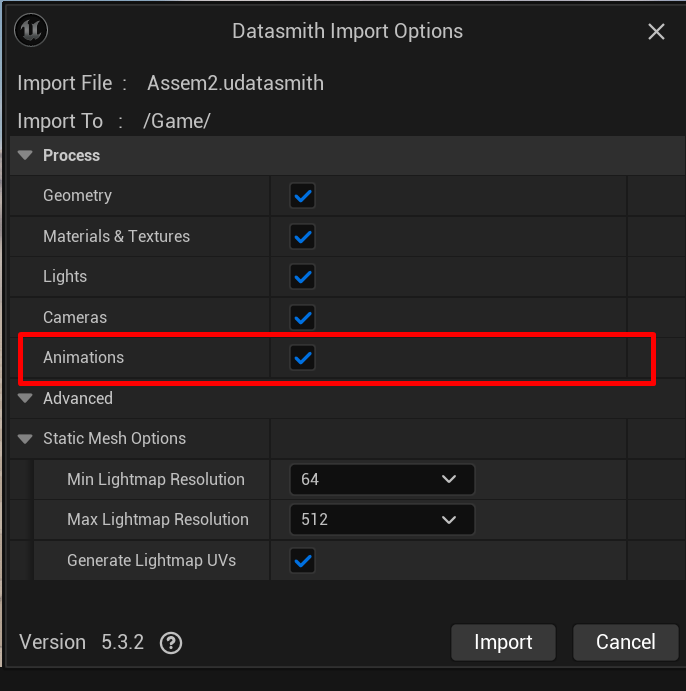
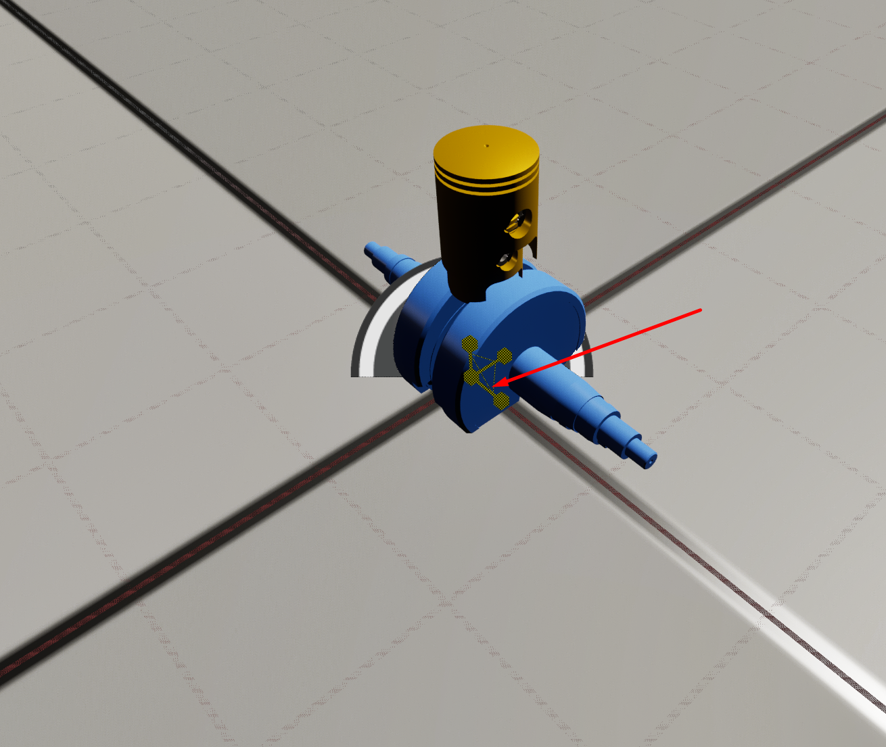
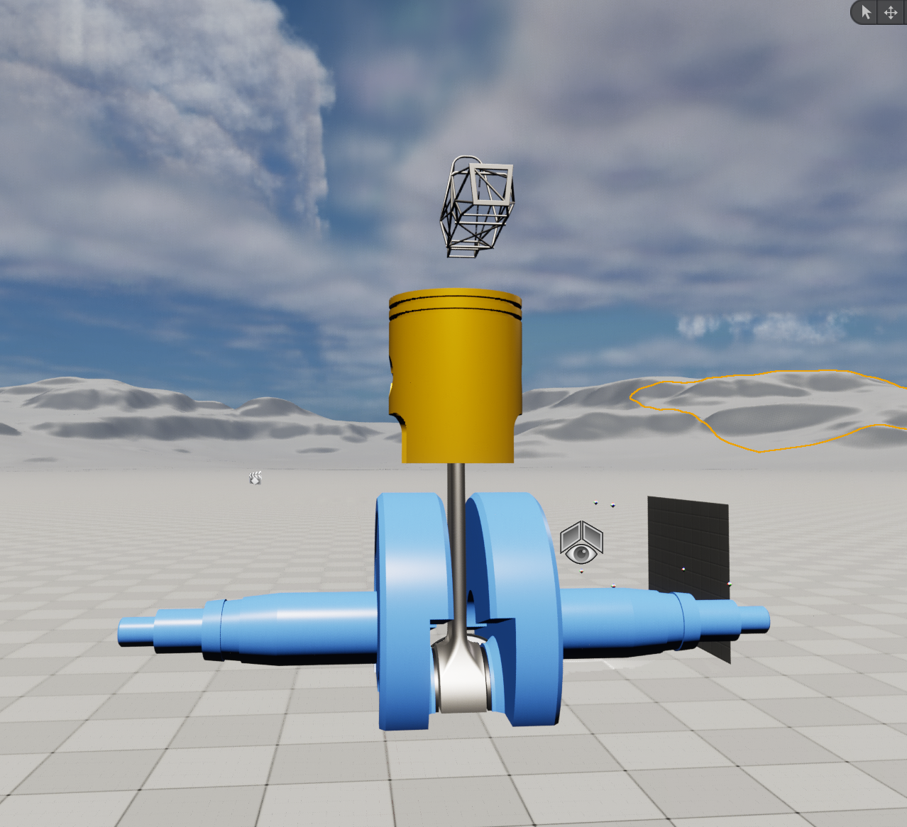
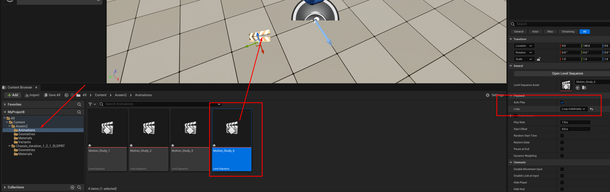

SolidWorks Animation on CAVE - Through Unreal
======================================================
If you are willing to run animations on CAVE, make sure you are able to run any 3D model first before jumping to this step.

- this tutorial assumes you have SLDASM (solidworks assembly) file ready to be imported into unreal with Motion Study (Animation to import), the following video shows animation inside solidworks

.. raw:: html

   <iframe width="560" height="315" src="https://www.youtube.com/embed/HFDngDBB1h0" frameborder="0" allowfullscreen></iframe>   
.. raw:: html

   

 

- go to file and choose save as and choose Datasmith extension (.udatasmith)

.. raw:: html

   

.. raw:: html

   

- go to unreal engine and using datasmith extension import the .udatasmith file into your level

.. raw:: html

   

- choose the folder you want to store these assets into, make sure you the animation import is activated too

.. raw:: html

   

.. raw:: html

   

- after importing the animation you should be able to find the assembly in your project outliner as seen bleow

.. figure:: imagesim/w25.png
   :width: 400px
   :align: center
.. raw:: html

   

- start scaling the model depending on your needs, if you want to scale the object over the 3 dimensions at once make sure that all 3 arrows are turned into yellow not only one of them as shown below

.. raw:: html

   

- after scaling the engine in all directions

.. raw:: html

   

- now go to content and look for animations and choose of the motion studies you want, make sure you select autoplay and loop indifinelty

.. raw:: html

   

.. raw:: html

   <iframe width="560" height="315" src="https://file.notion.so/f/f/6ec0143e-beb8-43cf-89e5-d54e230cd8d1/6e7ea3c2-8397-4e44-9fe8-6bab483beba1/20240511-1528-57.4881232.mp4?id=84708dd5-ceaf-4d3b-b487-86143be2673a&table=block&spaceId=6ec0143e-beb8-43cf-89e5-d54e230cd8d1&expirationTimestamp=1720720800000&signature=0kaVhwn4vuPoUvDXoa153V1-CK6TICmGz21GRi-E6UU&downloadName=20240511-1528-57.4881232.mp4" frameborder="0" allowfullscreen></iframe>   
.. raw:: html

   

 
- you can adjust the keyframe for the animations in case you wanted different behaviour by adjusting the coordinates of the components within every keyframe !

