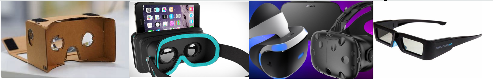
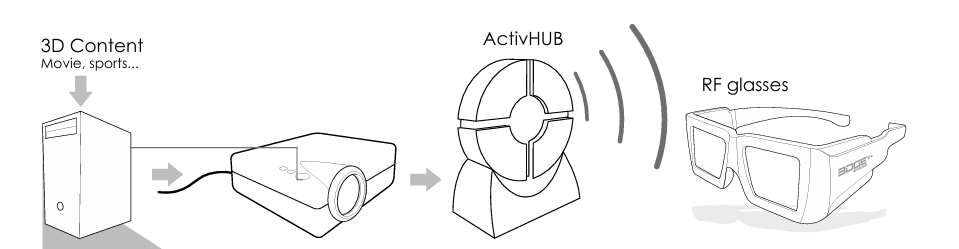
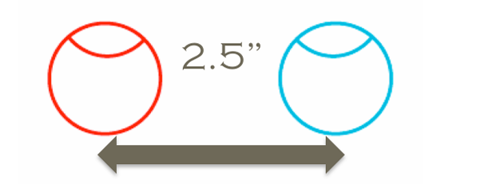
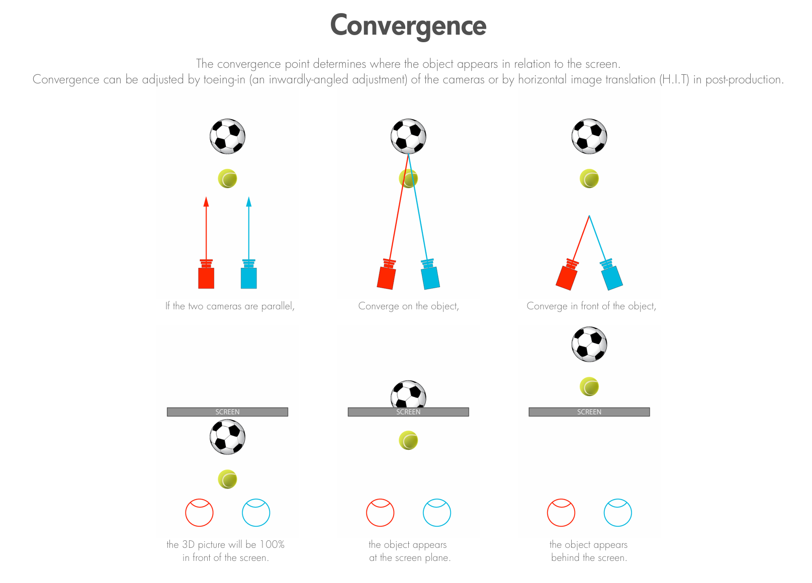

Introduction to 3D Effect
++++++++++++++++++++++++++++
3D Effect - Stereoscopy
 Generating 3D effect through screens and deceiving the user to feal that a 2D photo has some kind of depth or third dimension is called stereoscopy, the technique is very old and the photo below shows a very early stereoscope uses 2 photos each one of them have some offset to create the depth illusion for the person who looks through the tool

 .. figure:: Images/e1.png
   :alt: Alternate text for the image
   :width: 200px
   :align: center
 .. raw:: html

   

   

 Stereoscopy is one of the factors that affects level of immersion, it evokes place illusion or the feeling that you are somewhere else by generating the illusion of depth, this illusion is reached by showing a separate image to each eye.

 .. figure:: Images/e2.png
   :alt: Alternate text for the image
   :width: 200px
   :align: center
 .. raw:: html

   

   

 The video below is recorded using a 3D camera, video on the left is similar to one on the right except there is small offset between each one of them.

 .. raw:: html

   <iframe width="560" height="315" src="https://www.youtube.com/embed/umUO_r3NMgM" frameborder="0" allowfullscreen></iframe>

 but yet we can’t feel any 3D effect by watching this video using normal monitors, to feel the depth we still need extra hardware that will prevent the left eye from seeing the right part of the video and vice versa.

 To separate the videos/Images into 2 Halfs (Left frame and Right frane), we need one of the following tools 

3D Enabling Tools
 - Google Cardboard (you can build this in your own)
 - Mobile VR Headset **(available at the LAB)**
 - HTC vive Headset / or any other Head mounted display **(available at the LAB)**
 - Volfoni (manfacturer name, similar to samsung,HTC.. etc) glasses **(available at the LAB)**
  

.. raw:: html

   

  

and of course there are other tools, however I am currently focused on tools we have inside the EVE lab up to the moment.

Active 3D glasses
 There are different types of 3D glasses, one type of them is active 3D.

 Active 3D glasses rely on blocking and exposing light coming into your eyes with certain shuttering frequency, the video below shows the shuttering of the glasses, the video was recorded using a high-speed camera in real-time you won't’ be able to notice the shuttering.

 The glasses relies on a Microcontroller that exerts a voltage on a crystals, once the voltage is exerted those crystal turn from one state to another (blocking → passing) light, the signal that triggers the Microcontroller comes from the projectors through **ActiveHub.**

 The glasses get a signal from a device called **ActiveHub (Volfoni device)**, this device takes the synchronization signal from the projectors and emits a radio frequency signal to the **Volfoni 3D Glasses.**

.. raw:: html

   

 

To make sure that ActivHUB is sending the signals correctly, look at the rear projector you will find ActivHUB hanging over the projector, look at it’s LED and notice it’s **blinking behaviour** 

- ActiveHUB is on but not receiving any signals form projector blinking behaviour (very slow blink, one blink every 3 seconds) 
  
  .. raw:: html

   <iframe width="560" height="315" src="https://www.youtube.com/embed/XdqsnL0Z9i4" frameborder="0" allowfullscreen></iframe>
   
- ActiveHUB is on and receiving singals from projector and is emitting it to the glasses (Very Quick Blink, 2 Blink every 2 seconds)

.. raw:: html

   <iframe width="560" height="315" src="https://www.youtube.com/embed/hYHwseX_LW8" frameborder="0" allowfullscreen></iframe>

.. raw:: html

   

 

More on Stereoscopy
=====================
Shooting and transmitting images in Stereoscopic 3D is an attempt to replicate what we see with our own two eyes.

Your eyes are approximately two-and-a-half inches or 6cm apart (‘interocular distance’), so they see the same image from slightly different angles and perspectives. Your brain then combines these two images in order to gauge distance.

.. raw:: html

   

  

When shooting a 3D image, two cameras are used to capture separate images of the same object from slightly different angles at one fixed viewpoint.
When played back on a plano-stereoscopic display, the left image is shown only to your left eye and the right image only to your right eye.

Your brain then fuses these two images to give you a perception of depth.   

S3D Cinematography
 A pair of matched cameras, typically spaced at roughly adult eye ‘interocular’ distance (approx 6cm) is used to capture the image.
 This horizontal offset produces a binocular disparity.

 This binocular disparity, together with other information in a scene, including the relative size of objects, occlusion, shadows and relative motion, is
 processed by the brain to create depth perception.

 The distance between the left and right camera is called the ‘interaxial’.
 By adjusting the interaxial distance between cameras, we are able to dynamically increase and decrease the depth in a scene.
 
 .. figure:: Images/s2.png
    :alt: Alternate text for the image
    :width: 300px
    :align: center
 .. raw:: html

   

  

Convergence
 The convergence point determines where the object appears in relation to the screen.
 Convergence can be adjusted by toeing-in (an inwardly-angled adjustment) of the cameras or by horizontal image translation (H.I.T) in post-production.
 

  
