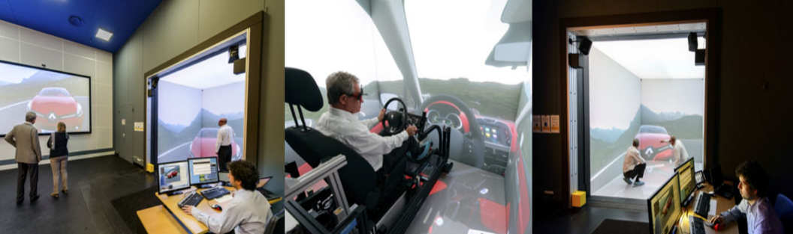

Applications of CAVE VR System
===========================================
CAVE system has been used by different companies to enhance product development, prototypes can be tested, interfaces can be developed, and factory layout can be simulated.

all without spending money on physical parts giving engineers to evaluate their design before prototyping, CAVEs are also used more and more in the collaborative planning in construction sector.

   Renault Cave.

the following photos are taken from Renault CAVE system in Guyancourt, France
According to Andras Kemeny, head of the Immersive and Virtual Reality Centre at **Renault**: 

*Using this new simulator, engineers and designers of future Renault vehicles will be able to sit behind the virtual wheel of a new model during the development process and take it for a drive in a 3D universe achieving a level of realism and detail never before seen in the automotive industry.*