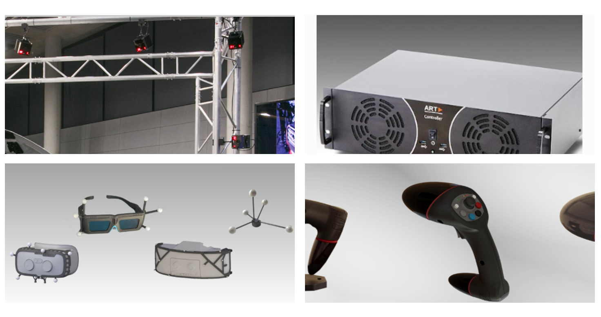
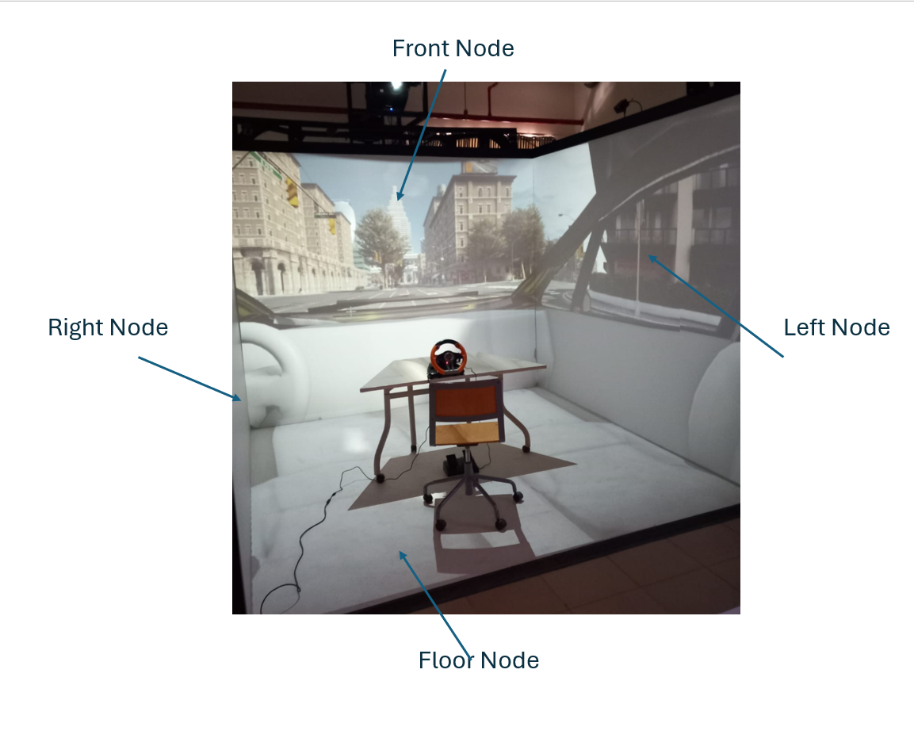

Components of CAVE
===========================================
cave can be described as integration of different subsystems

Tracking system
    Tracking system is responsible for tracking your movement inside the CAVE, Advanced Real Time (ART) systems supplied AUC with the tracking system.
    The tracking system is composed of : 
    
     - 4x high precesion tracking cameras
     - Advanced real time controller 
     - Markers
     - Flying Stick
  

   From left to right and up to down: precesion tracking cameras, Advanced real time controller, Markers and Flying Stick.

Projection system
    the projection system projects the rendered graphics, it could be made out of set of projectors or set of displays, in the case of AUC Cave, we are using 4 projectors each projectors
    project over one side of the CAVE Cube.

   AUC Cave Nodes.

Rendering system 
    responsible for carrying graphics calculation and handling the graphics pipeline usually made of Powerful workstation with high end graphics card.

Each one of those systems can work independently for example :
**you can run the projection system and rendering without tracking system, of course this won’t allow you to update the viewpoint or interact using the flystick.**
**you can run Tracking System with any Computer**
**you can run projection system with any powerful workstation.**