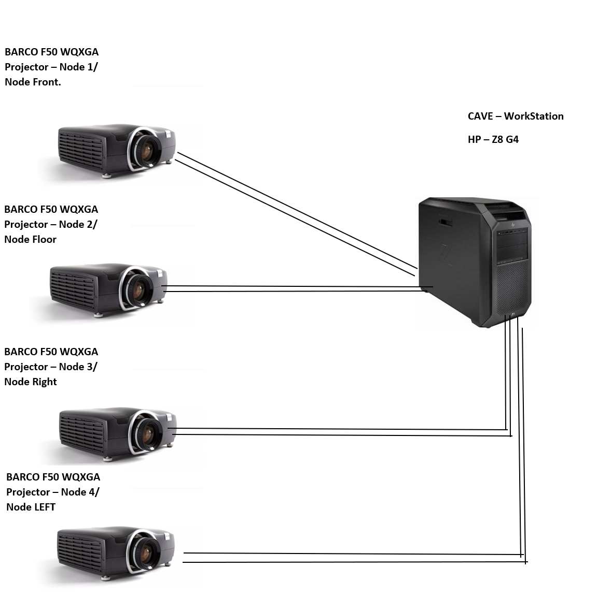
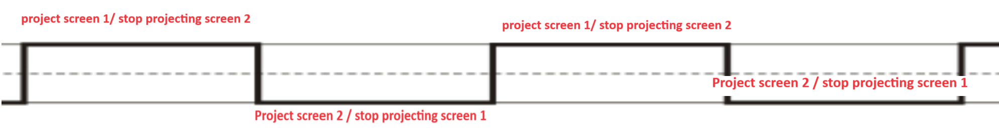
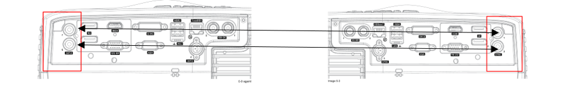
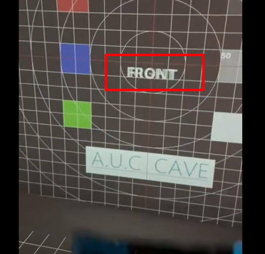
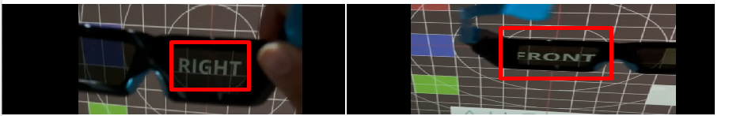

Projection System
===========================================
Currently the CAVE projections system is equipped with 4 projectors each one of them can project 2 different desktops this means that we can project up to 8 different desktops using the following setup.

.. raw:: html

   

 

you can think of each projector or node as 2 desktops monitor with 0.5 opacity displayed over each other) on the same wall, the projection is done with specific frequency, the very high frequency will evoke illusion that both displays are projected at the same time.

this projection is done with certain frequency for example:

at time t →                    monitor 1 is projected and monitor 2 is disabled

at time t+(Delta) →       monitor 2 is projected and monitor 1 is disabled

.. raw:: html

   

 

the frequency of the projectors is synchronized between all four projectors via Sync port and must be synchronized with your glasses and with other projectors, the figure below show how 2 projectors are connected

.. raw:: html

     

 

if you check windows display setting after connecting **one projector** to the computer you should be able to see something as shown below. p

Each projector enables 2 desktops, this is similar to connecting your pc with 2 monitors except the projector have 2 monitors embedded in one device.

.. raw:: html

  

we have four projectors from BARCO, Model F50 WQXGA you can access documentation and drivers for the projectors via their website F50 WQXGA - Product support - Barco each projector is connected to the Rendering System (CAVE WorkStation) via DP cables, this cable is similar to HDMI cables except it can support higher resolutions

.. raw:: html

     

 

If you look at the projected screen with & without 3D glass you will notice the following behaviour this will happen only if the 3D glasses are synchronized with your projector thorough ActiveHub

.. raw:: html

   <iframe width="560" height="315" src="https://www.youtube.com/embed/jNvN1IsL7uo" frameborder="0" allowfullscreen></iframe>

**Explanation :** 

  The following behaviour shows that if you look directly at the screen you will see the 2 words right and left overlapping each other

.. raw:: html

   

 

However if you look through one lens at a time you will see only one word either left or right as shown below 

.. raw:: html

   

 
   
This happened because your glass are synchronized with the projector displays 