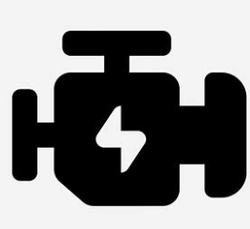

Rendering System
===========================================

To render the graphics, CAVE system uses Z8 workstation equipped with 

- 32 GB RAM
- 2 Processors 4112 Xeon Silver processor each 8 cores
- 2 GPU Quadro P5000 supported with Nvidia SYNC II which synchronize between different GPUs and supports mosaic configuration

The rendering system comes with different software packages that enables visualization through projection system 

- **Unreal Engine**
- **PARAVIEW**
- **Unity (Under development)**
  

So to visualize any 3D model on the system you will have to pass it through any of the previous packages. 