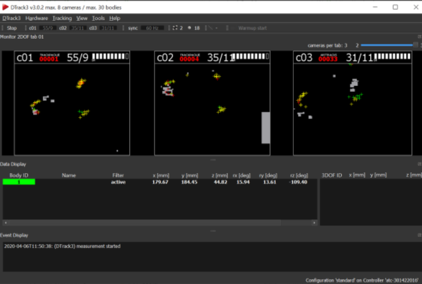

Tracking System
===========================================

.. hint:: 
  Do not upgrade any of the support software from those guys, upgrading may lead to a whole system failure till we buy a new license for the upgrade 

CAVE is supported with tracking system supplied from **ART (Advanced Real Time Tracking)**  
`|Startseite | Advanced Realtime Tracking GmbH & Co. KG <https://ar-tracking.com/en>`_

.. list-table::
   :widths: 50 50
   :header-rows: 0
   :align: center

   * - .. figure:: Images/a.png
         :width: 200px
         :alt: Photo 1
         
         Tracking cameras 
     - .. figure:: Images/c.png
         :width: 200px
         :alt: Photo 2
         
         Flystick (ours is older 
         version of this stick)
   * - .. figure:: Images/b.png
         :width: 200px
         :alt: Photo 3
         
         Controller+ Radio Transceiver
     - .. figure:: Images/d.png
         :width: 200px
         :alt: Photo 4
         
         Eye Trackers

- DTRACK software which receives tracked information over LAN Connection and can be passed to one of our support packages (Unity,Unreal,PARAVIEW)

.. raw:: html

   

 

**Data flow from trackers to CAVE !**
 As the user moves inside the CAVE, cameras track his movement, the movement data is sent over LAN connection to the **ART CAVE Controller,** the controller throughs this data over the network via a **cisco switch** the data can be read via any PC either **Z6 or Z8**  with **DTRACK** then the software can send the position information to **VRPN or Unreal Plugin**