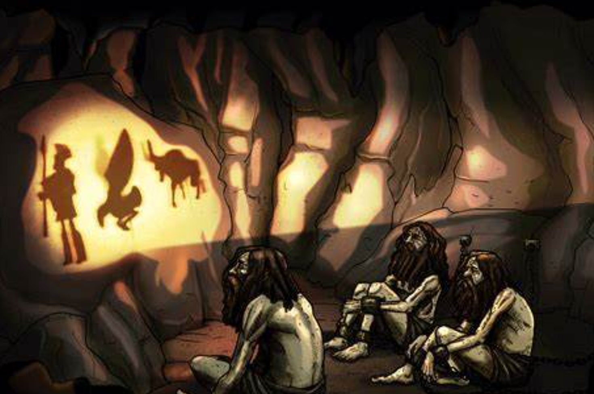
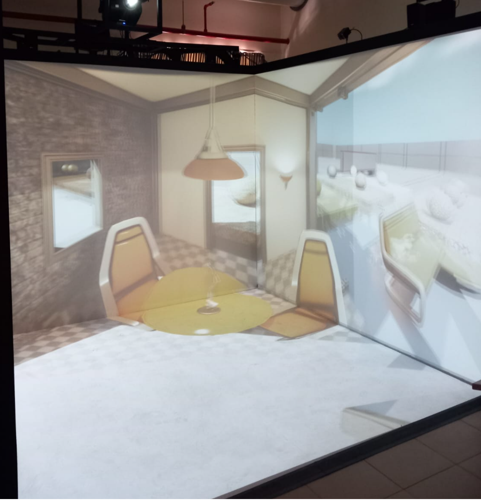

Introduction to CAVE (VR) System 
===========================================

**CAVE** is virtual reality environment, immersive one that relies on projectors to display virtual reality (VR) content instead of head mounted display, however some CAVE systems rely on display screens instead of projectors which is not the case at AUC EVE lab.

cave is acronym for cave automatic virtual environment the word cave is inspired from `Plato Imprisonment in the cave <https://en.wikipedia.org/wiki/Allegory_of_the_cave>`_.

   Plato's Allegory of the Cave.

Plato's Allegory of the Cave is a philosophical metaphor presented in his work "The Republic." It describes prisoners who have been chained inside a dark cave their entire lives, facing a blank wall. They can only see shadows cast by objects behind them, illuminated by a fire. These shadows constitute their reality, as they have never seen the actual objects or the outside world. One prisoner is freed and discovers the outside world, realizing that the shadows were mere reflections of true forms. Upon returning to the cave to enlighten the others, he is met with resistance and disbelief.

The CAVE VR (Cave Automatic Virtual Environment) system is a modern immersive virtual reality environment. It involves users standing inside a cube-like space where images are projected onto the walls, floor, and ceiling, creating a 3D immersive experience. Users often wear special glasses to enhance the 3D effect and interact with the virtual environment.

   AUC CAVE running House of Flames.

CAVE at the AUC is composed of 4 walls each one of them is called a node. the virtual enviroment content is developed at the EVE lab and can be used 
with different technologies such as (CAVE System, Mounted Headset or web content).

.. toctree::
   :maxdepth: 4
   :caption: Contents:

   CAVE_Philo
   CAVE_Application
   CAVE_Components
   3D_effect-Stereoscopy
   CAVE_Projection_System
   CAVE_Rendering_System
   CAVE_Tracking_System
