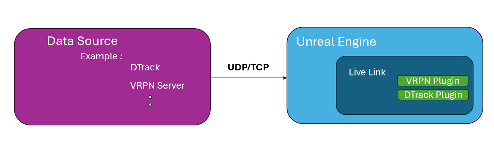
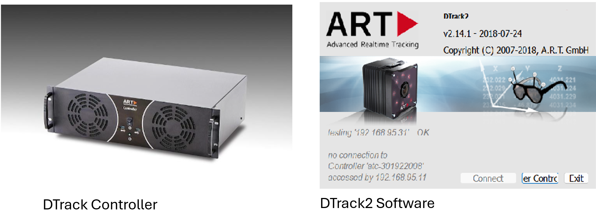
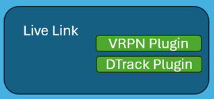
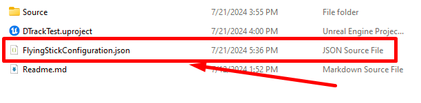

Introduction to Live Link
=======================================
Live Link is a tool that enables real time streaming of data (streaming of data is done over communication protocol eg: udp or tcp), the data streaming is done from a source to the game engine, this data can be manipulated later for certain purposes, for example updating the viewpoint of the user or making certain actions for actors (eg: moving forward backward based on flying stick button inputs).

.. raw:: html

   

In the example below what happens is we have **DTrack2** that listens to the **DTrack controller** as i press any button the controller sends the data over network to the **DTrack2**.

DTrack2 software publishes data to Unreal Engine over UDP / TCP Connection over specific port!

.. raw:: html

   

The video below shows integration results (button clicks) gets transmitted from the flying stick to the **DTrack Controller** then the **DTrack2** software intercepts this data from the real time controller and send it to the **Game Engine (Unreal)** over communication protocol

.. raw:: html

   <iframe width="560" height="315" src="https://www.youtube.com/embed/ed9LKgUUQAU" frameborder="0" allowfullscreen></iframe>   
.. raw:: html

   

 
   
Live Link is a general plugin that encompasses smaller plugins for example we can have add **dtrack plugin** which is useful when receiving data form **DTrack2** or **VRPN Link** which will be useful for a general input system**.**

.. raw:: html

   

How to start a project with live link integrated !
-----------------------------------------------------------------
I don’t recommend starting your setup from scratch, doing so will cause ton of problems and you will have to debug each one of them on your own, I recommend starting with the QuickStart projects and then editing these projects and importing whatever you would like to run inside unreal engine in these projects.

I will be supplying 2 QuickStart projects, you can find them in PlugAndPlay Repo.

1- Integrated FlyingStick
++++++++++++++++++++++++++++++++++

this projects includes a full integration of the flying stick with customized inputs, the below photo shows the customization 

By running the project from switchboard using the configurations inside the same repo you should end up having similar result to DTrack FlyingStick Integrated 

.. raw:: html

   

.. raw:: html

   <iframe width="560" height="315" src="https://www.youtube.com/embed/ed9LKgUUQAU" frameborder="0" allowfullscreen></iframe>   
.. raw:: html

   

 

- EyeTrackingProject