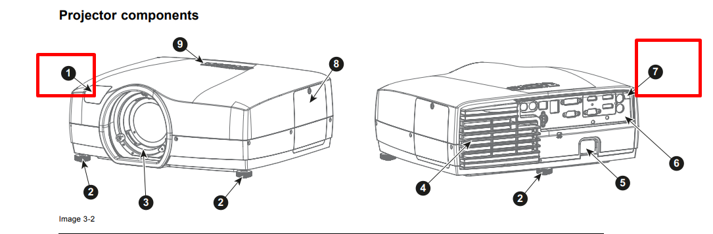
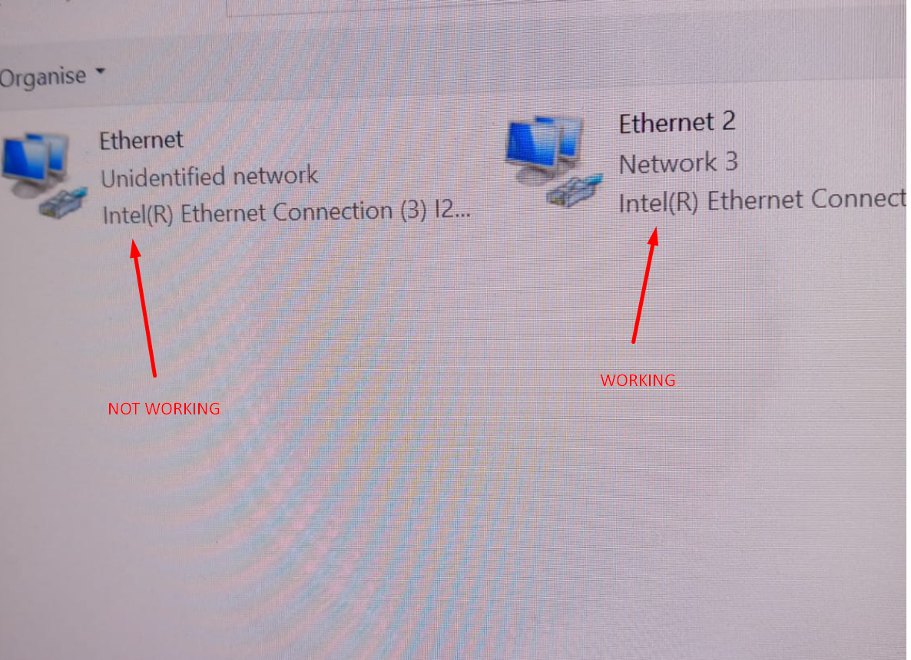

CAVE - Bugs - Q&A
~~~~~~~~~~~~~~~~~~~~~~~~~~~

This part should cover different set of bugs while working with cave system I encourage you to add more as you learn during working with the System !

1- CAVE Windows is DOWN
+++++++++++++++++++++++++
if the CAVE failed to boot windows OS multiple time in sequence this probably means that windows version is down !, this could happen sometime when you play with NIVIDIA configurations specially Mosaic configuration, that’s okay no need to panic.

normally we keep multiple restore points, make yourself familiar with windows restore point, you can find multiple tutorials online, another problem you might face is that OS language is set to French so when you watch the tutorial try to focus on icon shapes this will help you in case the language of the OS was still in French   

2- Projectors not responding
++++++++++++++++++++++++++++++++
Projector are not responding to my remote control or Projector are not turning on as you press the turn on button from the remote !

- one possible reason for this behaviour is that someone did disable IR sensor, the projector receives Infrared (IR) signal through 2 sensors one is called the front IR sensor the other is the back sensor
- the photo below shows you the IR sensors location, if you did disable the IR by accident (both IR) this could lead to this behaviour

.. raw:: html

   

 

solution
 normally you will solve this problem by either of the following approaches 

 1- open the projector manually by pressing the buttons on the projector you will probably need a ladder to be able to reach these button and then access the menu and enable the IR 

 2- if you have access to the projector through LAN or RS232 you should be able to change this setting using either `ProNet.Site <http://ProNet.Site>`_ or Projector Toolset both of theses tools are provided from BARCO the manufacturer of the projector, then again enable the IR sensors 

 3- Reset the projector by cutting off power (unplug the power) for 15 minutes this will make the projector reset to it’s default settings

3- The Projector LED is Blinking RED / or continuous RED
+++++++++++++++++++++++++++++++++++++++++++++++++++++++++++++++++
solution
 Projector LED’s shows different LED behaviour depending on different conditions according to the manual this could be result of 

 - overheating ! (try turning off the projector for a while and turn it on again)
 - faulty firmware setup ! (if you are upgrading the projector firmware make sure that you downloaded the appropriate model firmware)
 - According to BARCO ‘s manual the LED blinking behaviour is as follows : 

 .. figure:: imagesbug/q2.png
    :width: 400px
    :align: center
 .. raw:: html

   

 

4- Projector automatic Shutdown
+++++++++++++++++++++++++++++++++++++

Description:
 Projector Keeps shutting down after I turn them on ! they work for 5 minutes then stops and turns off ?! 

solution:
 this behaviour could be associated with automatic turn off feature ! this allows the projector to shutdown if it doesn’t receive any change in the signal received from the CAVE High Performance computer 

5- 3D Effect is now working (2 nodes are projected over each wall but the glasses doesn’t show any difference)
++++++++++++++++++++++++++++++++++++++++++++++++++++++++++++++++++++++++++++++++++++++++++++++++++++++++++++++++++++++++++
- one reason for this behaviour is that projector and your glasses are not synchronized !, you can confirm this by looking for the ActivHub LED behaviour (1 slow blink every second confirms that synchronization didn’t take place)  

.. raw:: html

   <iframe width="560" height="315" src="https://www.youtube.com/embed/XdqsnL0Z9i4" frameborder="0" allowfullscreen></iframe>

solution
 you need to configure the Projector to synchronize with ActivHub and then ActivHub will be able to synchronize with your glasses make sure that the following configuration are set ! ⇒ 

6- How to Replace Projector Lens ?
+++++++++++++++++++++++++++++++++++++++++++++++

you will need to have a new lens

1. Turn off the projector (unplug the power)

2. remove the old lens by pushing the red button (be extremely careful with the lens )

.. raw:: html

   <iframe width="560" height="315" src="https://www.youtube.com/embed/hV1nsq8jL9Y" frameborder="0" allowfullscreen></iframe>

3. Rotate the LENS and extract it after pushing the red button

.. raw:: html

   <iframe width="560" height="315" src="https://www.youtube.com/embed/FJdre7Emglw" frameborder="0" allowfullscreen></iframe>

.. raw:: html

   <iframe width="560" height="315" src="https://www.youtube.com/embed/JTsI9hHtVXQ" frameborder="0" allowfullscreen></iframe>  

4. very carefully add the lens back to it’s location and turn it (try to align the grooves )   
   
.. raw:: html

   <iframe width="560" height="315" src="https://www.youtube.com/embed/lUhS0Ms-L2c" frameborder="0" allowfullscreen></iframe>   
.. raw:: html

   

   
7- Projector doesn’t respond to ProNet.site 
++++++++++++++++++++++++++++++++++++++++++++++++++
projectors aren’t responding to the commands you send via `ProNet.site <http://ProNet.site>`_, BARCO Projectors can receive commands via different methods 

- Remote Control
- LAN Connection
- RS 232 Connection
- Projector Buttons

Possible Solutions
 **Approach 1:**

 Try to connect the projector to the CAVE High Performance computer using RS 232 connection instead of LAN, This will allow you to avoid the complexity of LAN setup

 .. figure:: imagesbug/q3.png
    :width: 400px
    :align: center
 .. raw:: html

   

 

 we currently have a very short RS 232 wire and not perfect one in the lab, you may need to buy extra male female if you are willing to connect the projector to the CAVE HPC (high perfomance computer )

 .. figure:: imagesbug/q4.png
    :width: 400px
    :align: center
 .. raw:: html

   

 
 
 .. hint:: 

   this is not VGA wires ! 

 **Approach 2: Fix LAN connection**

 This process could be quite complicated depending on your background or previous knowledge with networks ! 

 1. make sure that LAN Wires are connected and stable, sometimes it’s wire issues you can easily check the LAN LED, a blinking LED is a healthy sign (this doesn’t mean we have established connection yet but just means that wires are connected in other words you still need to setup your network from control panel in for the PC  or reconfigure IP settings for the projector  ) 

 .. figure:: imagesbug/q4.png
    :width: 400px
    :align: center
 .. raw:: html

   

 

 2. Check the IP address from the projector and make sure it is configured properly 

 .. hint:: 

     Currently we can connect only 2 Projector Via LAN at the same time, if you try to add more most probably they won’t work
  
 .. figure:: imagesbug/q5.png
    :width: 400px
    :align: center
 .. raw:: html

   

 
 
 make sure that you configure the Default gateway to be equal to CAVE IP address, and vice versa for example in case you have one projector connected to one PC, you will have to set configuration as follows 
 
 .. figure:: imagesbug/q6.png
    :width: 400px
    :align: center
 .. raw:: html

   

 
   
   if the connection is set up ! you should see the following in  View network connection
  
 .. figure:: imagesbug/q7.png
    :width: 400px
    :align: center
 .. raw:: html

   

 
  
 if every thing is working is setup, now you can add a new device from 
 `ProNet.Site <http://ProNet.Site>`_
 and add the ip address of the projector and try to turn the projector on/ off again  

8- I can see only one desktop (node) over each Wall ? 
++++++++++++++++++++++++++++++++++++++++++++++++++++++++++++++++++
this could happen for multiple reasons i will be covering some of them

9- Projector shows very weird lines (green / white)
+++++++++++++++++++++++++++++++++++++++++++++++++++++++++++++++

.. raw:: html

   

 

.. raw:: html

   <iframe width="560" height="315" src="https://www.youtube.com/embed/b_nE_xLnOss" frameborder="0" allowfullscreen></iframe>   

there is 2 possible reasons for this problem both could result this weird behaviour 

- at the current moment CAVE system works on 2 GPU from NVIDIA Quadro P5000 the problem is they won’t be able to support the whole quality