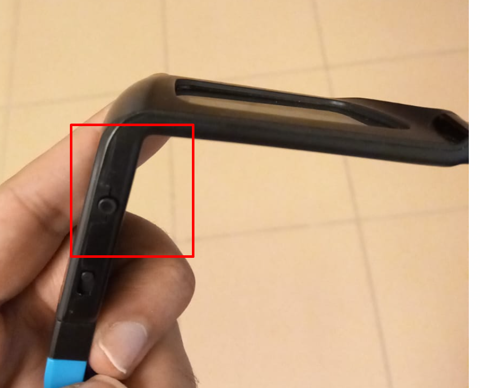

CAVE Hardware Configuration
===========================

1. Run Client and Server on Windows OS
--------------------------------------

cave system is made out of 2 computers one is considered as server and the other one is considered as client for this server.

.. raw:: html

   

to run the cave make sure that 2 server and client are running on windows operating system, in case of the server you need to make sure it’s running on windows since it has dual boot (linux and windows)

After starting the server click on F9 multiple times to ensure accessing to the dual boot menu and choose UEFI-Windows boot manager, don’t forget to ask your colleagues or supervisor for password for both devices server and client.

.. raw:: html

   

2. Ensure that network is between the Server and Client is Connected Properly
---------------------------------------------------------------------------------------------

Now you have to make sure that server and client are connected properly via network to do so access the cmd of the client and type the following 

.. code:: bash
  
  ping 192.168.168.95.11
 

you should get the following response.
the following response shows that there is no data loss between the Server and Client which is perfect.

.. raw:: html

   

3. Ensure that Projectors are correctly connected to the Server
-----------------------------------------------------------------------------

CAVE has 4 Projectors, Each Projector is connected to the PC (Server) by 2 DP Cables, DP Cables are HDMI like cables except they are more suitable for CAVE system

4 projectors each one of them have 2 connection this means normally you have 8 connections (if the CAVE works by it’s full capacity), by the time of writing this documentation only 3 projectors out of 4 are working, you can see below the connection to the server by DP Cables

.. raw:: html

   

6 DP Cables, At Full Capacity you should see 8 DP Cables instead of 6 (2 Cables per each projector)

to make sure that these connections are working properly, you can check the number of screens in your Server.

to do so we need to access the Server Remotely and check the number of screens, to do so we use Lite Manager it’s normally pinned to the taskbar

.. raw:: html

   

after that we can access the Server

.. raw:: html

   

 

and then check the number of the displays since we are working with 3 projectors only i am expecting to see 6 screens.

.. raw:: html

   

.. Hint::
 if you connected projector 4, you should expect additional 2 screens 
 
1. Check Projector input source
-------------------------------------
currently you have to check the following configuration manually, the full documentation will explain why did i choose the following configuration.

4.1. Check 3D Settings
~~~~~~~~~~~~~~~~~~~~~~~~~~~~

for each projector make sure that the following configuration is set

1- Set 3D mode to dual head

.. raw:: html

   

2- change the dual head setup so that each source run on a different display port as follows  

.. raw:: html

   

4.2. Check source configuration
~~~~~~~~~~~~~~~~~~~~~~~~~~~~~~~~~~~~~~~~

always make sure that 2 sources run on the same frequency and same quality you can check this from status menu or clicking on info button

.. raw:: html

   

4.3. Check synchronisation configurations
~~~~~~~~~~~~~~~~~~~~~~~~~~~~~~~~~~~~~~~~~~~~~~~~~

this very important, if not set properly this could make you fail of feeling the effect of 3D

.. raw:: html

   

After configuring these steps always check the ActiveHUB LED behaviour 

.. raw:: html

   

`ActivHub Rf50  <https://www.bing.com/ck/a?!&&p=7b8c0a4b38982f0eJmltdHM9MTcxMTMyNDgwMCZpZ3VpZD0zY2EyNjYzNC00MDk1LTZmYjgtMWFiZi03NWZhNDFlOTZlYWUmaW5zaWQ9NTQ3Mg&ptn=3&ver=2&hsh=3&fclid=3ca26634-4095-6fb8-1abf-75fa41e96eae&psq=volfani+rf&u=a1aHR0cDovL3ZvbGZvbmkuY29tL2VuL2FjdGl2aHViLXJmNTAv&ntb=1>`_

ActiveHub Rf50 offline  (3D won’t work)  — slow blink, one every 3 seconds 

.. raw:: html

   <iframe width="560" height="315" src="https://www.youtube.com/embed/XdqsnL0Z9i4" frameborder="0" allowfullscreen></iframe>

Active Hub online (3D works) - Quick Blink 2 blinks every 3 seconds 

.. raw:: html

   <iframe width="560" height="315" src="https://www.youtube.com/embed/hYHwseX_LW8" frameborder="0" allowfullscreen></iframe>

4.4. Turn on the Glasses
~~~~~~~~~~~~~~~~~~~~~~~~~~~~~~~~~
the VR LAB is equipped with multiple 3D Glasses, to turn them on push the following button   

.. raw:: html

   

after pushing the button the glasses should blink as follows  (this blinking behaviour is related to it’s battery level more on that later )

**Turning on 3D glasses** 

.. raw:: html

   <iframe width="560" height="315" src="https://www.youtube.com/embed/HM4q_k7yd1Q" frameborder="0" allowfullscreen></iframe>
.. raw:: html

   

**Turning off 3D glasses**

hold the button for a while till the glasses starts blinking.

.. raw:: html

   <iframe width="560" height="315" src="https://www.youtube.com/embed/v6xjQQHw48Y" frameborder="0" allowfullscreen></iframe>
.. raw:: html

   

**3D Effect**

the following video shows 3D effect from behind the glasses (glasses filter screens, so that each eye will see only one screen at a time as the video shows below)

.. raw:: html

   <iframe width="560" height="315" src="https://www.youtube.com/embed/jNvN1IsL7uo" frameborder="0" allowfullscreen></iframe>