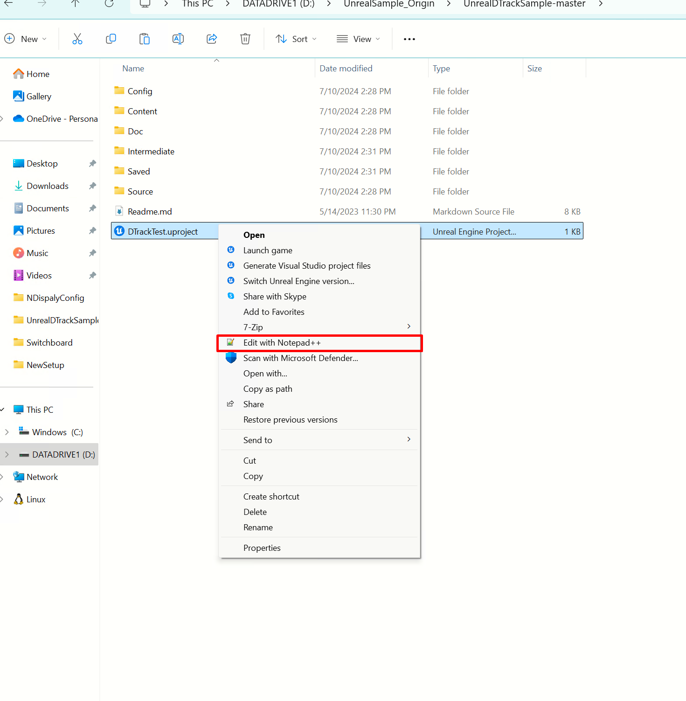
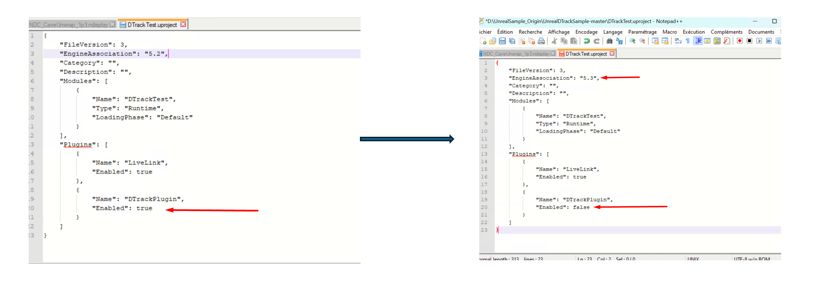
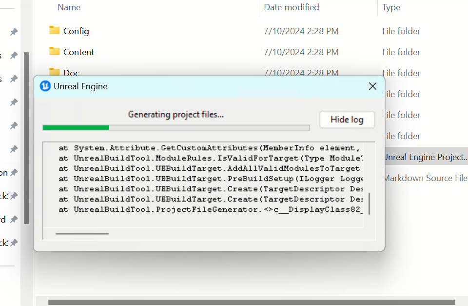
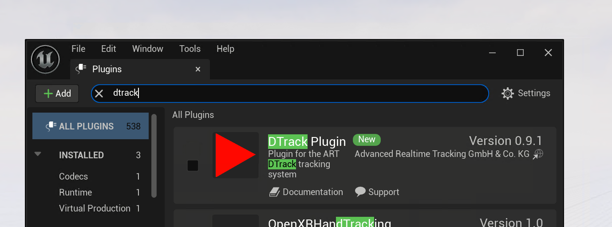
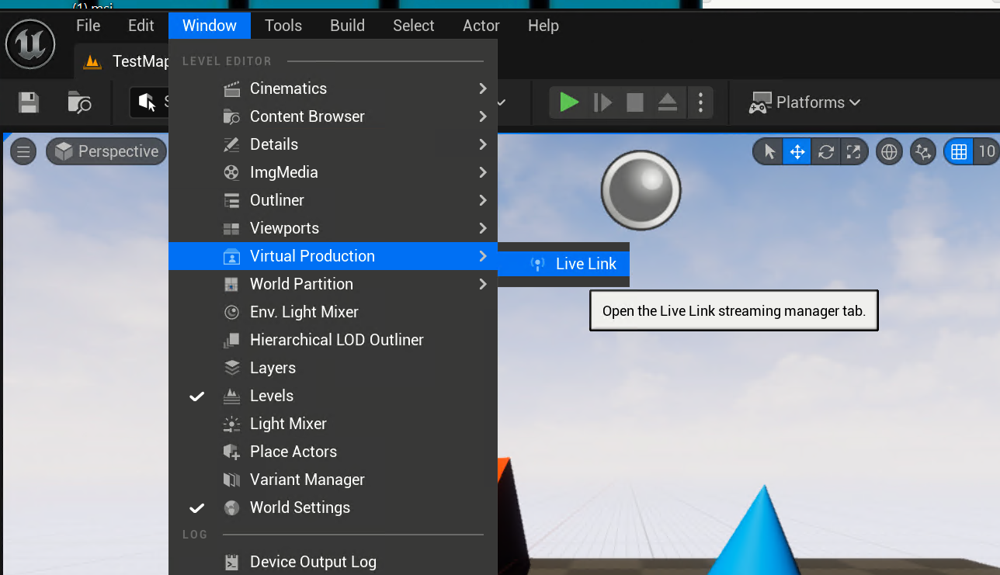
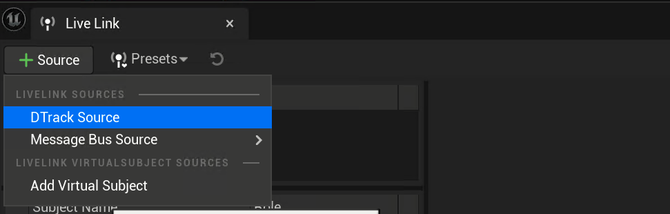
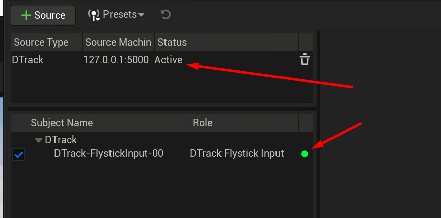
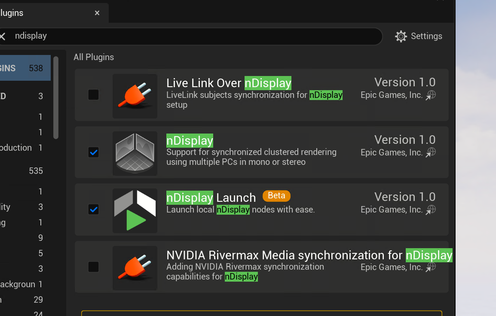

Installing DTrack Plugin
==========================
To install the DTrack Plugin make sure you have some tools 

**Installing DTrack Sample**

Advanced Real time systems offers a sample project that we can use directly and start working with our project you can download it by going to `UnrealDTrackSample <https://github.com/ar-tracking/UnrealDTrackSample>`_

after you download it open the project using Notepad++ and edit the project so that DTrack plugin is disabled 

.. raw:: html

   

change the version of the engine to your installed version and turn the DTrackPlugin to false for now also disable livelink ! (this is not shown in the image below)

.. raw:: html

   

now it will start generating the project files as 

.. raw:: html

   

.. hint:: if the program asks if it should rebuild the project files click yes (this means that it’s still build the files ! just wait more time it takes around 10 minutes to generate the project files)

after the project rebuild files you can go and add dtrack plugin from the interface as follows 

.. raw:: html

   

go to window and then virtual production 

.. raw:: html

   

add a new DTrack Source

.. raw:: html

   

make sure you have a green and 

.. raw:: html

   

.. raw:: html

   

