Integrating the flying Stick
=====================================
To integrate the flying stick with Unreal Engine, we will use the DTrack Plugin. This plugin significantly simplifies the integration process. The steps for the integration are as follows:

- **Installing DTrack plugin**
- **Configuring your project with DTrack plugin for your project**

1- Installing DTrack plugin
++++++++++++++++++++++++++++++++++++++++++
As of the time of writing this document, the installation process for the DTrack Plugin is somewhat more complex compared to the usual plugin installation from the marketplace. Normally, you would simply visit the marketplace and install your plugin directly.

DTrack plugin is provided by Advanced Realtime Tracking (ART), and they share the source code in the following repository.

`UnrealDTrackPlugin <https://github.com/ar-tracking/UnrealDTrackPlugin>`_

the following page explains the installation and build process ! 

.. toctree::
   :titlesonly:
   :maxdepth: 12
   
   if

2-Configuring your project with DTrack plugin
+++++++++++++++++++++++++++++++++++++++++++++++++++++++++
after installing the plugin you still have to configure the plugin so it work appropriately with your project !

In this part I will clearing the path in front of you to make the configuration process easier.

- open DTrack program in the machine that will be receiving the data from ART Controller for example if you are willing to run the tracker with the any Z6 machine you will have to install DTrack software on it, however if you want to run it on the cave open the DTrack on the CAVE
- running the DTrack on the machine that will be receiving reduces the overhead on the network simply the DTrack will be sending the location data and button data directly to the  engine, instead of passing it again through network!

.. figure:: imagesifs/f1.png
   :width: 300px
   :align: center
.. raw:: html

   

option 2 will be to send the data over the network then the data can be received from unreal engine

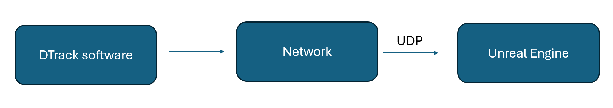
.. raw:: html

   

- the DTrack software can be opened only once ! across network, simply you can’t open multiple instances of the DTrack, the following message will appear in front of you in case you tried to run it while another machine on the network is running ! in the following picture the machine with ip address **192.168.95.11**

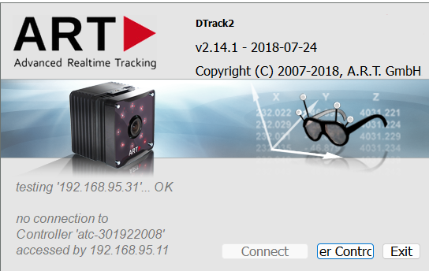
.. raw:: html

   

- now click connect

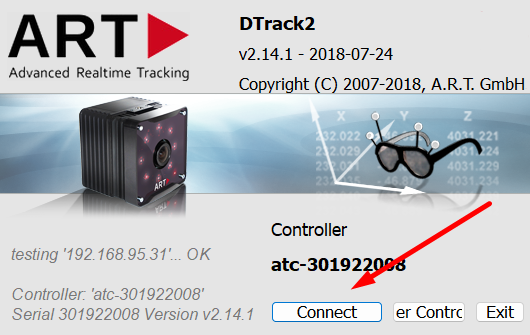
.. raw:: html

   

- after you connect to the controller go to settings → then output or click F9

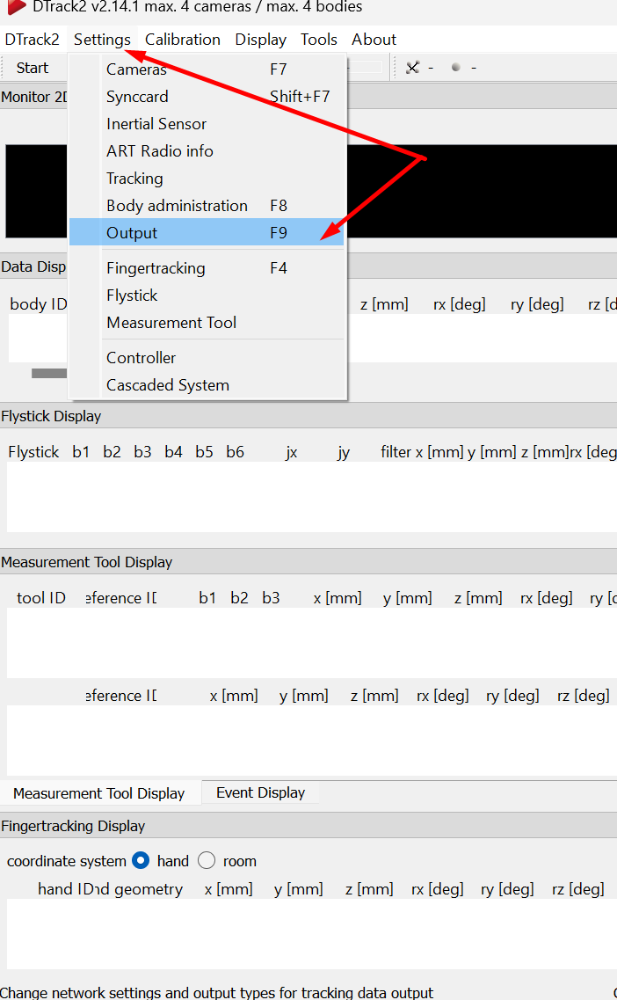
.. raw:: html

   

- you can either broadcast the message you receive from the controller or send it to specific computer with specific ip address or send the data to this computer ! we will be proceeding with the last choice (sending data to the current computer ), to do so it very important to notice the UDP Port that we will be transmitting data to! which will be **5000**

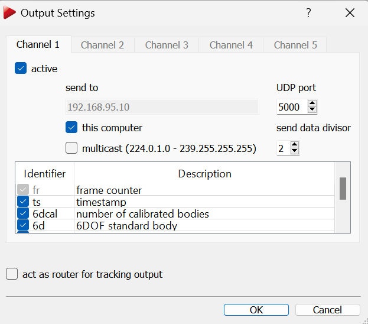
.. raw:: html

   

- now click ok and add then click start (the software will start sending data over this port)

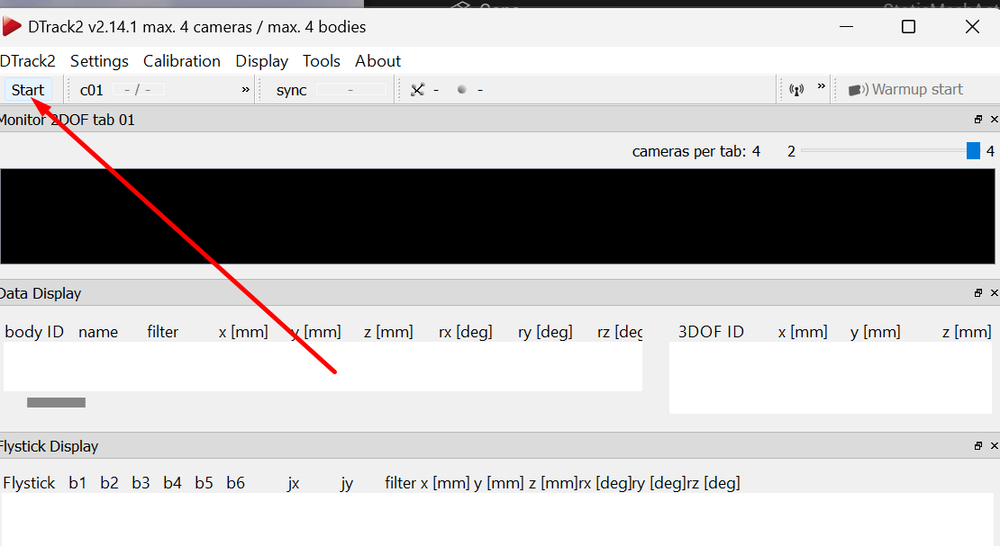
.. raw:: html

   

- now go to unreal engine and make sure you have the live link plugin ! go to edit→plugins→ search for live link and download it!

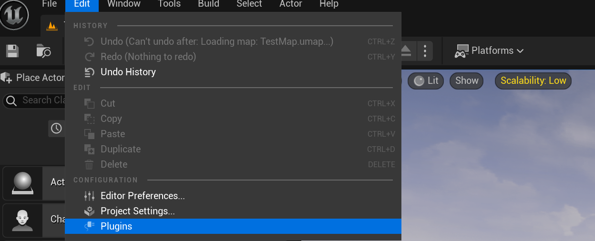
.. raw:: html

   

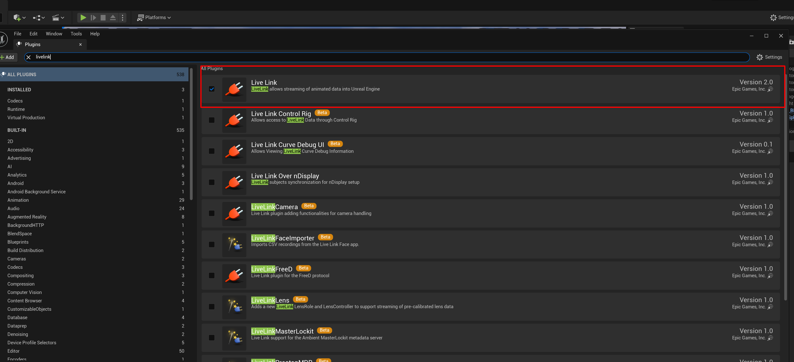
.. raw:: html

   

- now go ahead to windows → virtual production and choose **live link**

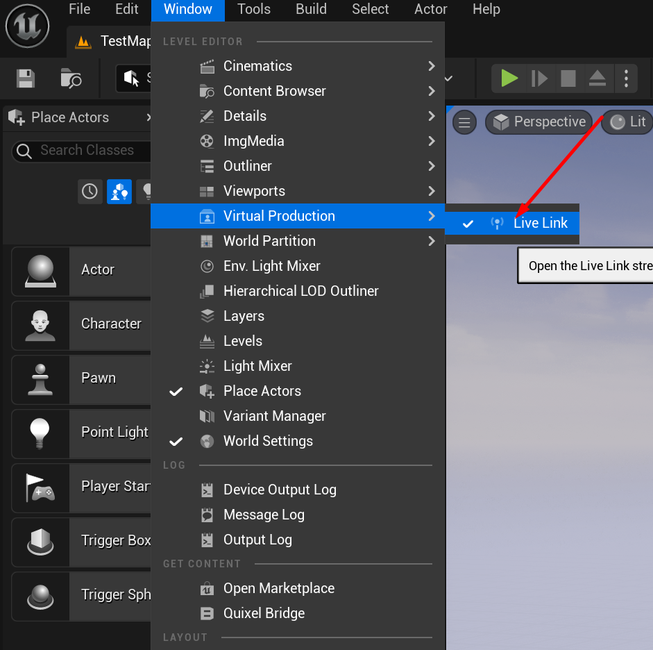
.. raw:: html

   

- you should find something similar to the following window !

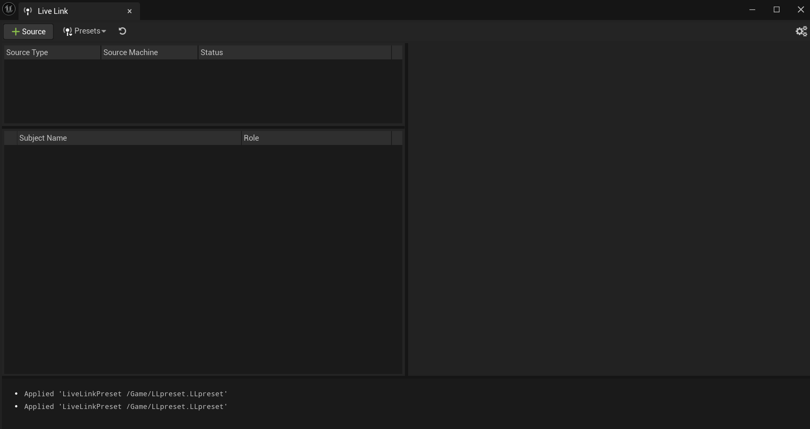
.. raw:: html

   

- go to source and then add a DTrack Source

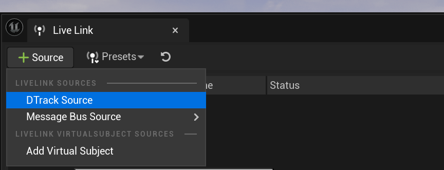
.. raw:: html

   

- for learning purpose i made the value of the dtrack data port and server ip as follows :

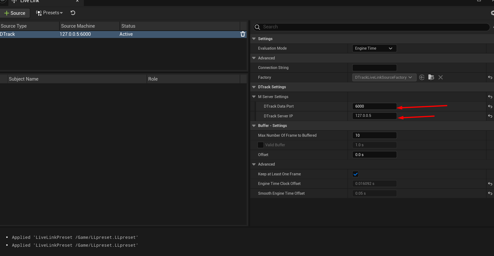
.. raw:: html

   

- the above configuration is wrong one, why ? because you have to pass for the link the correct address and port, if you are running DTrack over the same machine that runs unreal you should add the following port !

127.0.0.1 (this tells unreal that UDP messages are coming from another prgoram at the same machine)

5000 (that’s the port we specified for DTrack to send data over)

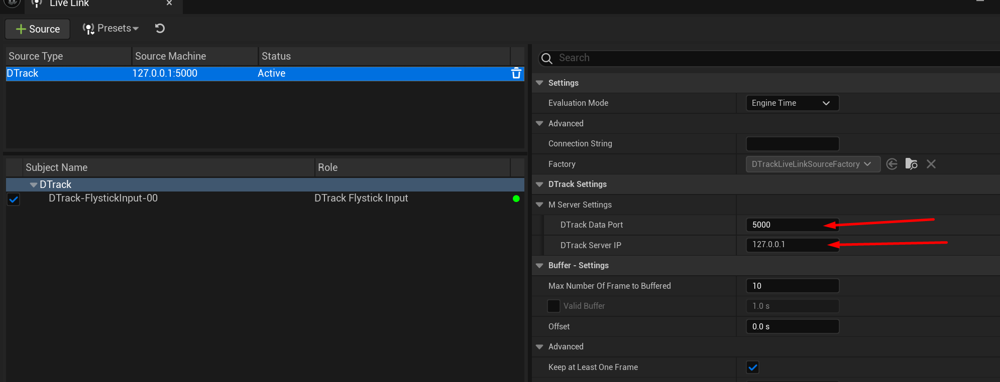
.. raw:: html

   

- now to make the livelink stored somewhere so that you can update it ! i recommend you save your configuration as a preset.

.. figure:: imagesifs/f15.png
   :width: 300px
   :align: center
.. raw:: html

   

- you can always check who is using the port number 5000 by using the command netstat

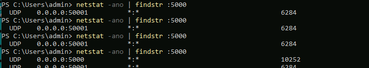
.. raw:: html

   

- do not install livelink over ndisplay it results ton of wierd errors !

.. Hint::  the osc is the listening server responsible for receiving data and sending it to control node you can only have one instance of it running, if you try to open 2 versions (open one unreal editor that listens to the osc server and then later open switchboard - switchboard won’t be able to listen since it came second, however if you open switchboard first and then try to open editor the editor will fail to listen to the flyingstick updates )

After building the plugin you can move the plugin to the engine plugins folder, the path of this folder is normally similar to this 

.. Hint:: switchboard keeps track of everthing in a logfile inside your project 

for example :

.. code:: 

  D:\Unreal Projects\PlugAndPlay\UnrealDTrackSample-master\Saved\Logs\Switchboard 

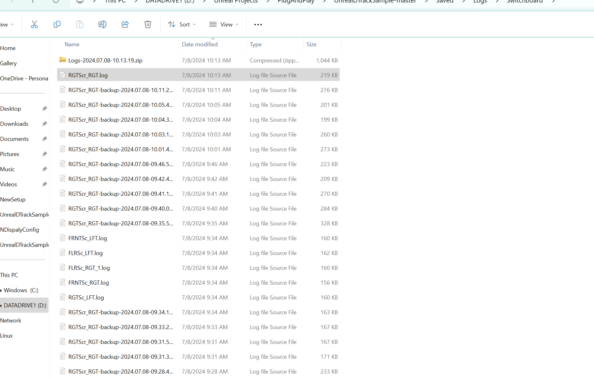
.. raw:: html

   

.. hint:: if you find only one display only that responds to the flying stick update that’s probably a problem with the preset

.. hint:: add livelink ndisplay!

.. code:: 

  C:\Program Files\Epic Games\UE_5.3\Engine\Plugins

Then you will make a new folder and name it DTrackPlugin and move your build inside it !, i alread

