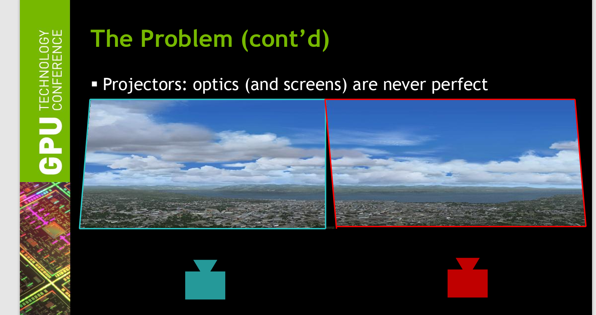

 
CAVE - screen warping tool
=======================================

What is screen warping & why we need it?
+++++++++++++++++++++++++++++++++++++++++++++++++
Screen Warping
 warping means to apply some distortions to your screen depending on your needs, these distortions could be :

 - Cropping part of your display
 - Adjusting edges of your display
 - Squeezing the screen in x-Direction or y-Direction

 **Squeezing Screen (notice what happen to aspect ration)**

 .. raw:: html

   <iframe width="560" height="315" src="https://www.youtube.com/embed/J3uyK-Evxtk" frameborder="0" allowfullscreen></iframe>   

 **Adjusting Edge shape (focus on screen edges)**

 .. raw:: html

   <iframe width="560" height="315" src="https://www.youtube.com/embed/fOaxojvax4A" frameborder="0" allowfullscreen></iframe>   

 you can turn your rectangle square screen into trapezoid or even hexagon or any other complex shape.

 .. figure:: imagesscreen/s1.png
    :width: 400px
    :align: center
 .. raw:: html

   

 

 The screen before transforming is called **Screen-Source** and after warping is called **Screen -Destination.**

 Screen - Source is made out of multiple vertices and we need to make modification to the source vertices to end up with the Screen - Destination shape

 NIVIDIA developed some functions and made these functions/API available for everyone, the called it NIVIDIA - WARP and BLEND, you can visit their website `Warp and Blend | NVIDIA Developer <https://developer.nvidia.com/warp-and-blend#:~:text=Warp%20and%20Blend%20are%20interfaces%20exposed%20in%20NVAPI,projectors%20or%20displays%20into%20one%20larger%20display%20surface.>`_

why we need warping with CAVE system?
++++++++++++++++++++++++++++++++++++++++++++++

CAVE is made out of 4 projectors. these projectors are not perfect, that’s totally fine and common with different projector from different types, to manage these imperfections we can either use hardware solutions or software solutions.

NIVIDIA developed a software solution it’s made out of  functions / API’s that can allow you to make some distortion / Warping for the projector screen and even blend some of these intersection.

Warping can compensate for these imperfections; however we write some code to correct for this distortion.

.. raw:: html

   

 

or maybe we have very weird screen shape and we are willing to project the screen to this custom shape, perhaps at this point you will need more advanced tools, check the CAVE system below 

.. raw:: html

   <iframe width="560" height="315" src="https://www.youtube.com/embed/rCJ1UPbWBPo" frameborder="0" allowfullscreen></iframe>   
.. raw:: html

   

 
   
What are the API’s NIVIDIA provided for Warping?
+++++++++++++++++++++++++++++++++++++++++++++++++++++++++++
Functions
 - NvAPI_Initialize()

 This line initializes Nvidia api, it’s essential and can’t be skipped.

 - NvAPI_EnumPhysicalGPUs(nvGPUHandles, &gpuCount);

 This function enumerate all available GPU in your device and store the number of gpus in variable called gpuCount

 - NvAPI_GPU_GetConnectedDisplayIds()

 This function returns the connected displays, this will help you if you are willing to warp multiple screens (in out case we are trying to warp 2 screens over each node, and we have total number of 4 nodes).

 by node i mean one side of the cave for example front node  means (front projector)

 - NvAPI_GetErrorMessage(error, estring)

 The function extracts the error and stores it in a string called estring

 - NvAPI_GPU_SetScanoutWarping(dispIds[dispIndex].displayId, &warpingData, &maxNumVertices, &sticky);

 this function does the warping by getting the displayid and the warping data in our case will be array of source and destination points, maxNumVertices which represent the total number of vertices that will be used in warping process and variable sticky that takes value 0 or bigger than 0, if the value is 0 this means that warping won’t stick on restarting, positive values means that warping will stick to the pc even after restarting it.

variables
 - Source Points

 The following lines extracts information about source points, information such as width of the screen and height of the screen, x & y of vertex number 0, from the object desktopRect, width and height.

 in the case of 4 nodes warping vertex number 0 is the one at upper left 

 .. code::  

        // this shape resembles the screen 
        //  (0)  ----------------  (2)
		//       |             / |
		//       |            /  |
		//       |           /   |
		//       |          /    |
		//       |         /     |
		//       |        /      |
		//       |       /       |
		//       |      /        | 
		//       |     /         |
		//       |    /          |
		//       |   /           |
		//       |  /            |
		//       | /             |  
		//   (1) |---------------- (3)

 the actual nodes location with my current code will be as follows : 

 .. figure:: imagesscreen/s3.png
    :width: 400px
    :align: center
 .. raw:: html

   

 .. Hint:: there is different approaches to get source points for example you can extract srcLeft and Top from OS object instead of desktopRect object, however i recommend to stick to those i tried multiple sources untill i eventually managed to warp using desktopRect, if you are willing to know the difference between different objects i recommend you pay the following website a visit  `Nvapi Warp & Blend <https://developer.nvidia.com/rtx/path-tracing/nvapi/get-started>`_ 

 .. code:: 

	  			float srcLeft = (float)desktopRect.sX;
				float srcTop = (float)desktopRect.sY;
				float srcWidth = desktopRect.sWidth;
				float srcHeight = desktopRect.sHeight;

 - Destination points

 the following variables are used to generate the destination points coordinates x,y

 .. code:: 

     float	dstWidth = scanoutRect.sWidth / 2.0f;
	 float	dstHeight = scanoutRect.sHeight;
	 float	dstXShift = dstWidth / 2.0f;
	 float	dstYShift = dstHeight / 2.0f;
	 float	dstLeft = (float)scanoutRect.sX + dstXShift;
	 float	dstTop = (float)scanoutRect.sY; //TODO play

 - Squeeze variables

 those variables will allow you to squeeze the screen in the x-direction or in the y-direction, they work by adjusting the final value of destination point

 .. code::    

	 float sqz_x = 90;		
	 float sqz_y = 48;

 - Vertices format

 the function NvAPI_GPU_SetScanoutWarping that does the warping accept the source and destination in different formats, in my code we are using XYUVRQ format, you can change it if you want but i recommend you have a strong reason to do so.

 .. code:: javascript 
     
	   warpingData.vertexFormat = NV_GPU_WARPING_VERTICE_FORMAT_TRIANGLESTRIP_XYUVRQ;

 - Points structure

 currently i am using a structure to represent each vertex 

 .. code:: 

     struct Point {
				float Sx; // source x value 
				float Sy; // source y value

				float Dx; // destination x value
				float Dy; // destination y value

    };

 after defining the above structure i assigned the following values for the sources and destination for the first 4 edge vertices 

 .. figure:: imagesscreen/s4.png
    :width: 400px
    :align: center
 .. raw:: html

   

 .. code:: 

     // point 0

     P0.Sx = srcLeft;
     P0.Sy = srcTop;
     P0.Dx = dstLeft - dstXShift + sqz_x;
     P0.Dy = dstTop + sqz_y;

     //point 2
     P2.Dx = dstLeft - dstXShift + sqz_x;
     P2.Dy = dstTop + dstHeight - sqz_y;
     P2.Sx = srcLeft;
     P2.Sy = srcTop + srcHeight;

     //point 1
     P1.Dx = dstLeft + dstWidth + dstXShift - sqz_x;
     P1.Dy = dstTop + sqz_y;
     P1.Sx = srcLeft + srcWidth;
     P1.Sy = srcTop;

     // point 3
     P3.Dx = dstLeft + dstWidth + dstXShift - sqz_x;
     P3.Dy = dstTop + dstHeight - sqz_y;
     P3.Sx = srcLeft + srcWidth;
     P3.Sy = srcTop + srcHeight;

 - float vertices[]

 the information about warping must be passed in a certain format, in our case it’s an array called vertices holds the information as follows : 

4 vertices warping format
 In case you are willing to warp screen using only 4 vertices only, the 4 vertices will have the following order 

 each vertex will be represented in matrix by 6 values x,y,u,v,r and q (the format we already agreed on)

 x → represent the destination x value 

 y → represent the destination y value 

 u → represent the source x value

 v → represent the source y value 

 r,q → parameters that you can leave them to their default value 0,1

 for point 0,1,2,3 the array will hold values as follows 

 .. code:: 

	 P0.Dx,P0.Dy,P0.Sx,P0.Sy,0.0f,1.0f,     // point 0 source,destination,r and q values 
     P1.Dx,P1.Dy,P1.Sx,P1.Sy,0.0f,1.0f,     // point 1 source,destination,r and q values 
     P2.Dx,P2.Dy,P2.Sx,P2.Sy,0.0f,1.0f,     // point 2 source,destination,r and q values 
     P3.Dx,P3.Dy,P2.Sx,P3.Sy,0.0f,1.0f,     // point 3 source,destination,r and q values 

Warping Visualization Tool
+++++++++++++++++++++++++++++++
what is this tool ?
 warping visualization tool helps us to visualize warping before implementing it, in early iterations of using Nvapi we had to run code multiple times to know the correct values for source and destination points that will align each node against it’s neighboring node 

 to reduce time and effort we developed a tool to visualize the warping before implementing it using MATLAB, we also wanted to develop a GUI that will allow us to generate the points using GUI instead of playing in the source and destination manually 

 a good warping will ensure

 - line alignment
 - no gaps
 - minimal distortion for each square

 **example of bad warping coordinates vertices**
 
 .. figure:: imagesscreen/s5.png
    :width: 400px
    :align: center
 .. raw:: html

   

